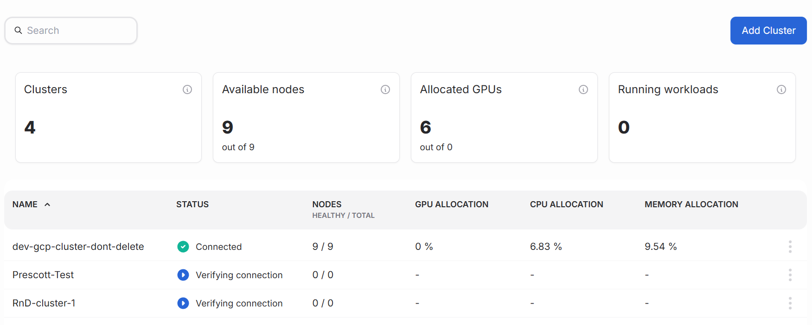
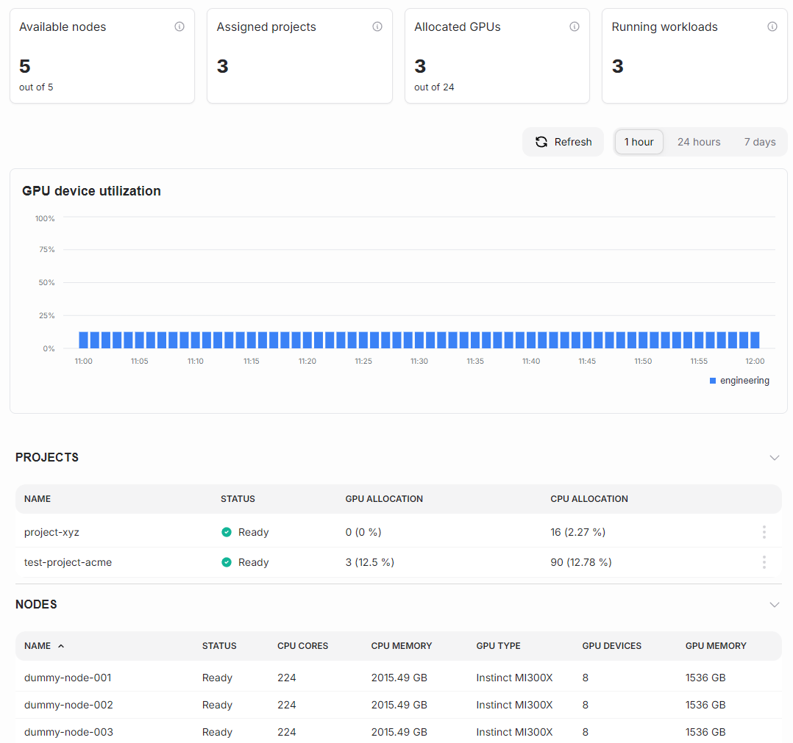

---
tags:
  - airman
  - cluster
---

# Clusters overview

The Clusters page provides a quick and easy way to see the status of all your clusters.

## What is a cluster?

A cluster is a set of nodes (interconnected computers) that work together to run containerized applications, including AI/ML models, data pipelines, and inference services.

Cluster is the physical part of the platform installation which can be managed in the Airman user interface.

## Clusters overview page

The clusters overview provides a list of the clusters added to SiloGen platform, along with their status. You can see the following information about your clusters:

**Clusters** - Clusters for your organization that have been onboarded to AI Resource Manager. Onboarding clusters allows you to manage resources, quotas, and workloads on them.

**Available nodes** - Total number of nodes available across all clusters. AI Resource Manager routinely pulls node information from clusters including resources and health

**Allocated GPUs** - Total number of GPUs allocated to quotas, across all clusters. Users belonging to user groups with GPU quotas are guaranteed allocated GPU resources for their workloads, in the corresponding clusters.

**Running workloads** - Total number of active workloads across all clusters. Workloads submitted via AI Resource Manager optimally scheduled, and tracked and monitored for resource usage and health.

**Clusters table**

| Column            | Description                                                                                                                                                                            |
| ----------------- | -------------------------------------------------------------------------------------------------------------------------------------------------------------------------------------- |
| Name              | The name of the cluster                                                                                                                                                                |
| Status            | Status of the cluster                                                                                                                                                                  |
| Nodes             | The number of nodes associated with this cluster. Shows the number of healthy nodes and total nodes.                                                                                   |
| GPU allocation    | The share of the total number of GPUs allocated to quotas in the cluster. Users belonging to user groups with GPU quotas are guaranteed allocated GPU resources for their workloads.   |
| CPU allocation    | The share of the total number of CPUs allocated to quotas in the cluster. Users belonging to user groups with CPU quotas are guaranteed allocated CPU resources for their workloads.   |
| Memory allocation | The share of the total amount of memory allocated to quotas in the cluster. Users belonging to user groups with GPU quotas are guaranteed allocated GPU resources for their workloads. |

## Single cluster status

The Cluster page provides a quick and easy way to see the status of your cluster.

**Available nodes** - The total number of nodes available in the cluster. AI Resource Manager routinely pulls node information from the cluster including resources and health.

**Assigned quotas** - Quotas assigned to the cluster resources. User groups can be assigned quotas to limit the amount of resources they are guaranteed on the cluster.

**Allocated GPUs** - The total number of GPUs allocated to quotas in the cluster. Users belonging to user groups with GPU quotas are guaranteed allocated GPU resources for their workloads.

**Running workloads** - Total number of active workloads running on the cluster. Workloads submitted via AI Resource manager optimally scheduled, and tracked and monitored for resource usage and health.

**ASSIGNED QUOTAS table**

| Column         | Description                                  |
| -------------- | -------------------------------------------- |
| IDENTIFIER     | Unique identifier for the quota              |
| STATUS         | Status of the quota                          |
| ASSIGNED TO    | The user group that this quota applies to    |
| GPU ALLOCATION | Total number of GPUs allocated to this quota |

**NODES table**

| Column      | Description                                  |
| ----------- | -------------------------------------------- |
| NAME        | Name for the node                            |
| STATUS      | Status of the node                           |
| CPU CORES   | Number of CPU cores available on the node    |
| CPU MEMORY  | Total number of GPUs allocated to this quota |
| GPU TYPE    | Type of GPU                                  |
| GPU DEVICES | Number of GPUs on the node                   |

