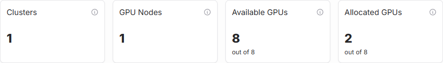
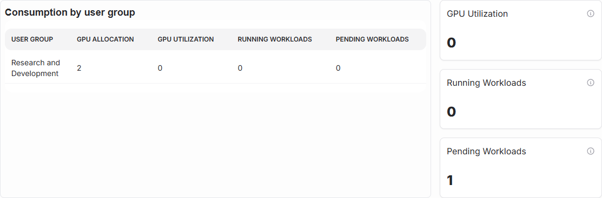
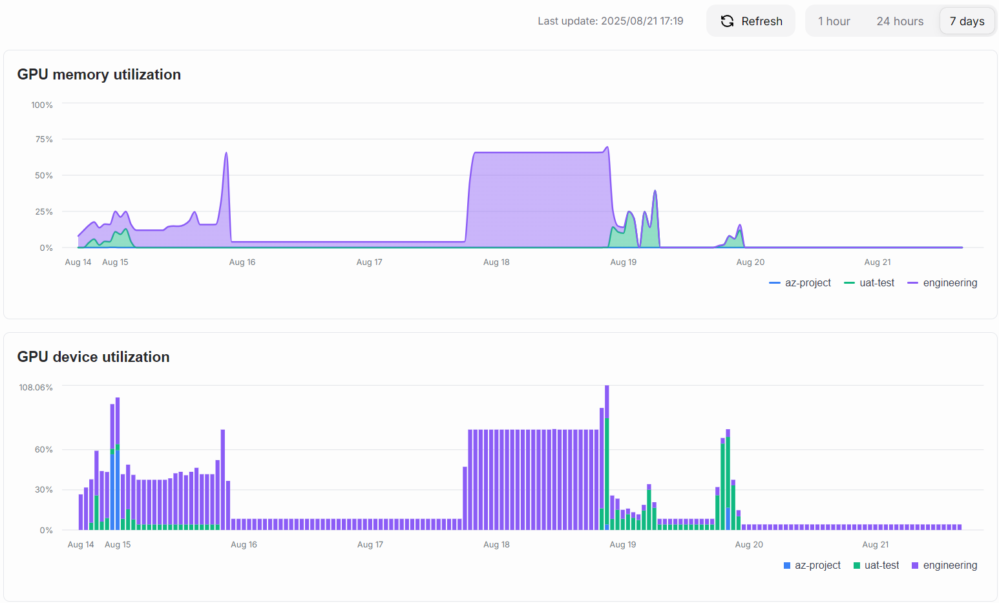

# Dashboard

The dashboard provides users with an overview of the cluster and the workloads running on it.

## Clusters and Nodes

The section shows the number of onboarded clusters, the number of GPU nodes in the clusters, the total number of GPUS on all clusters and the number of allocated GPUs via quotas.

## Allocations and Workloads

This section displays current statistics for workloads such as GPU utilization, the number of running workloads and pending workloads. It also lists resource usage by user group.

GPU memory and device utilization are shown in a graph over time. Users can change the time scale of these graphs using the buttons above the graph.

