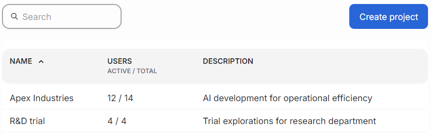

---
tags:
  - projects
  - airman
---

# Manage projects

A project is a container for managing work. It has a specified compute quota which is used for limiting resources. Users can initiate workloads only in the projects they are assigned to. Only platform administrators can create new projects and assign users to them.

The main projects view lists available projects, the amount of assigned users and a short description about the projects. Adding new projects happens by clicking the "Create project" button.

The project-specific quota is currently set in the Quotas section of Airman.

Clicking the projects's name opens the edit view. The view has a form for editing project details. Project's name is permanent and cannot be changed. Click "Save changes" button to accept the updates.

Below the form is an area called Danger zone. It contains a button for deleting the project. Deleting a project is a permanent action, and shouldn't be done without proper consideration.

The right pane lists users assigned to the project and an option to add new project members. Administrators can also invite new users directly to the project.
