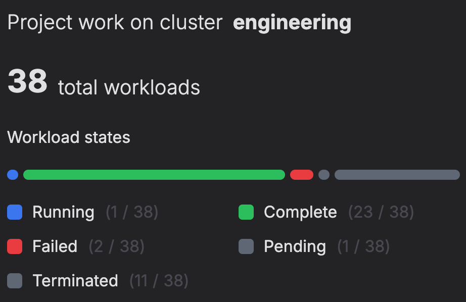
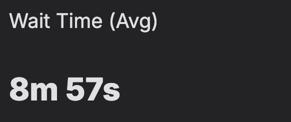
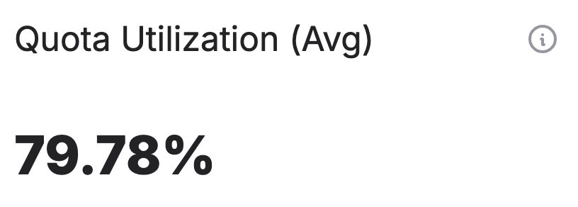
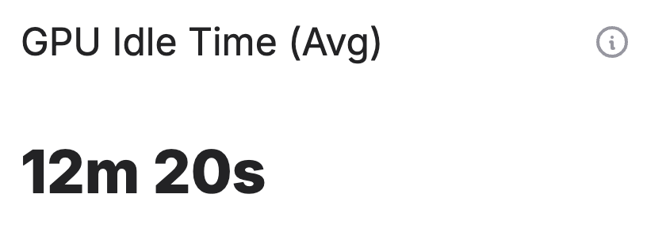
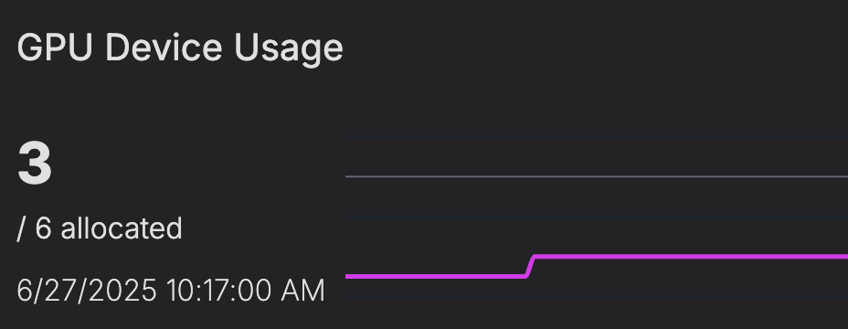
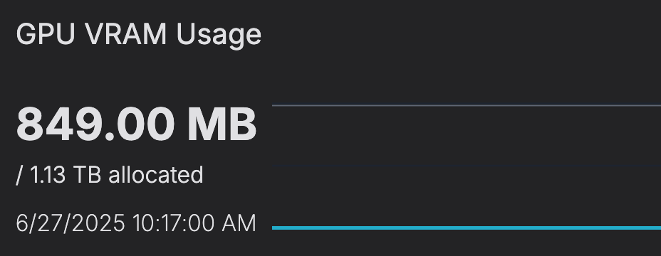
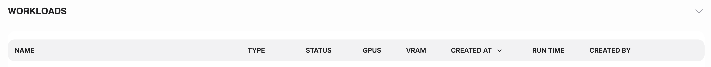
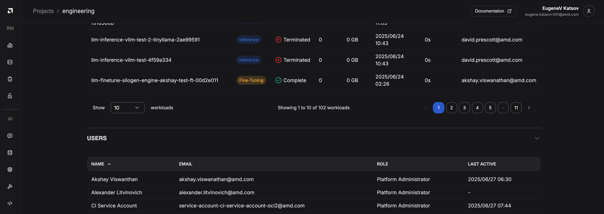

---
tags:
  - projects
  - airm
---

# Project dashboard

The project dashboard breaks down all the attributes of a project into an easy to read user interface. This is also the page from which to edit the project details.

The project dashboard can be set to display information for the past hour, 24 hours and 7 days. Manually refreshing the information with the Refresh button will fetch the latest information.

## Workloads panel

.

This panel shows the cluster name as well as the number of workloads in a particular state. More detailed information can then be found by looking at the workloads table.

## Wait time panel

.

This panel shows the average time that workloads in the given project spent waiting to start (within the specified time range).
This includes both the total time each workload was in a pending state, plus any additional time still pending if the workload is currently waiting to run.

## Quota utilization

.

The average ratio of utilized GPUs versus the allocated GPUs for all workloads running within the project (within the specified time range).

## GPU idle time

.

The GPU idle time panel shows the average time that GPUs allocated to the given project spent idle (not actively used) during the specified date range.

For each point in time, the system looks at how many GPUs were allocated to the project and how many were actually being used. The difference between these two numbers represents the number of idle GPUs at that moment. This difference is then multiplied by the time interval (step size) to get the total idle time for that period.

## GPU device usage

.

The number of GPU devices utilized by workloads in this project versus the GPUs allocated to it (within the specified time range).

## GPU VRAM usage

.

The amount of GPU VRAM GPU utilized by workloads in this project versus the VRAM allocated to them, via the allocated GPUs (within the specified time range).

## Workloads table

.

The workloads table lists all the workloads associated with the current project. Additionally each entry in the table also includes the following information:

- type: the type of workload
- status: the status of the workload
- GPU and VRAM usage
- run time: the total execution time for the workload
- which project member created the workload

## Users table

.

The users table lists every member of the project including the role and the last time the logged in.
