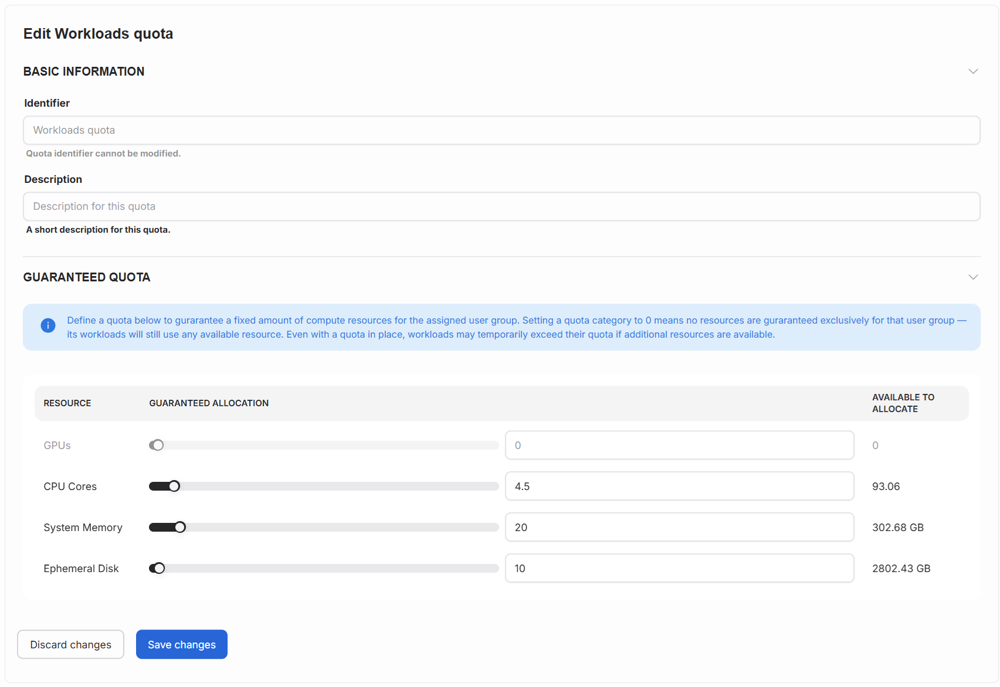

---
tags:
  - airman
  - quota
  - add quota
---

# Manage quotas

This article explains how to define quotas for your projects. In Airman, you can set quotas for GPUs and CPUs for your projects. Users belonging to a project are guaranteed the allocated quota for their AI workloads.

!!! info
    There can be only one quota for a project per cluster.

## Set the guaranteed quota values

Define a quota below to guarantee a fixed amount of compute resources for the assigned project. Setting a quota category to 0 means no resources are guaranteed exclusively for that project—its workloads will still use any available resources. Even with a quota in place, workloads may temporarily exceed their quota if additional resources are available.

**GPUs:** The guaranteed allocation for the number of GPUs. "Available to allocate" shows the total amount available.

**CPU Cores:** The guaranteed allocation for the number of CPUs. "Available to allocate" shows the total amount available.

**System Memory:** The guaranteed allocation for the amount of memory (GB). "Available to allocate" shows the total amount available.

**Ephemeral Disk:** The guaranteed allocation for the amount of disk space (GB). "Available to allocate" shows the total amount available.

Press `Save changes` to finish creating the quota.

