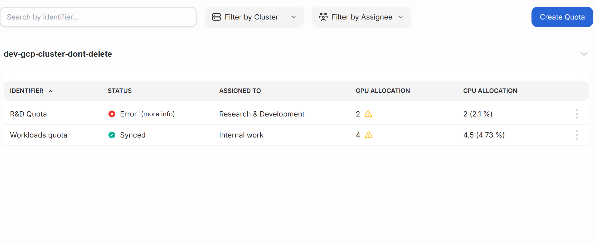

---
tags:
  - airman
  - quota
---

# Quotas overview

Quotas ensure that computational resources are appropriately shared between groups. Without quotas, some workloads might use all the resources, leaving other workloads waiting. Quotas define a _minimum_ set of resources that are guaranteed. There is no maximum, so quotas can be exceeded if unused resources are available.

Quota is a usage limit reserved for a team to accomplish their tasks. Quotas are useful for ensuring everyone gets their fair share of compute resourses.
In Airman you can manage GPU and CPUs quotas for your user groups.

## Quotas table

The filter bar can be used to find the correct quota. Filtering can be done by keyword, cluster, or quota assignee.

The list view shows available quotas with the applied filters from the filter bar. Each quota has a submenu that allows you to modify or delete the quota.

| Column         | Description                                                                                                                                  |
| -------------- | -------------------------------------------------------------------------------------------------------------------------------------------- |
| Identifier     | The name of the quota                                                                                                                        |
| Status         | Status of the quota                                                                                                                          |
| Assigned to    | The user group that this quota applies to.                                                                                                   |
| GPU allocation | Number of GPUs allocated for this user group. Users belonging to this user group are guaranteed the allocated GPU quota for their workloads. |
| CPU allocation | Number of CPUs allocated for this user group. Users belonging to this user group are guaranteed the allocated CPU quota for their workloads. |

