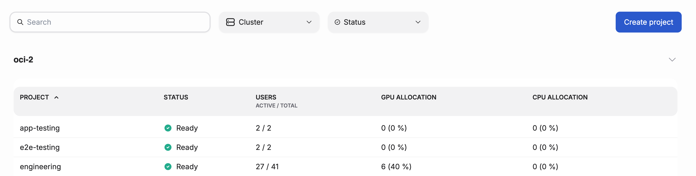

---
tags:
  - airm
  - quota
  - project
---

# Project quotas overview

A quota is a usage limit set on a project. Teams use project quotas to accomplish their tasks by ensuring everyone gets their fair share of compute resources. Without quotas, some workloads might use all the resources, leaving other workloads waiting.

Quotas define a _minimum_ set of resources that are guaranteed. There is no maximum, so quotas can be exceeded if unused resources are available.

In AIRM, you can manage GPU, CPU, memory and disk quotas for your projects. When a new project is created the quota for all resources is zero. Only after the project is created can the quotas be updated.

## Quota status

In AIRM a project is a way to separate whatever tasks a team is working on. The status of the project is the status of those tasks.

For the most part AIRM works with AI focussed tasks which are primarily resource heavy workloads. In order for the workload to run, the cluster needs to be made aware of the the quota requested by the project.

Currently, the project status reflects the state of this application of the quota to the cluster.

