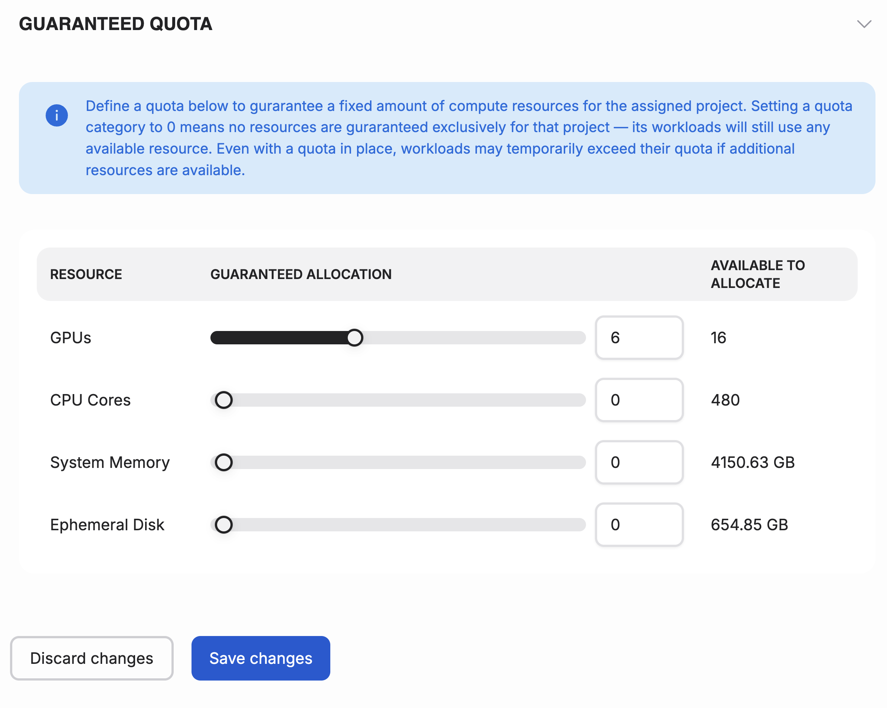

---
tags:
  - airm
  - quota
  - add quota
---

# Manage quotas

This article explains how to define quotas for your projects. In Airm, you can set quotas for GPUs and CPUs for your projects. Users belonging to a project are guaranteed the allocated quota for their AI workloads.

!!! info
There can be only one quota for a project per cluster.

## Guaranteed quota panel

Project quota can be adjusted using the slider.

GPU allocation - Number of GPUs allocated for this project. Users belonging to this project are guaranteed the allocated GPU quota for their workloads.

CPU allocation - Number of CPUs allocated for this project. Users belonging to this project are guaranteed the allocated CPU quota for their workloads.

System memory - Memory allocation for this project. Users belonging to this project are guaranteed the allocated memory for their workloads.

Ephemeral disk allocation - Disk storage allocation for this project. Users belonging to this project are guaranteed the allocated storage for their workloads.
