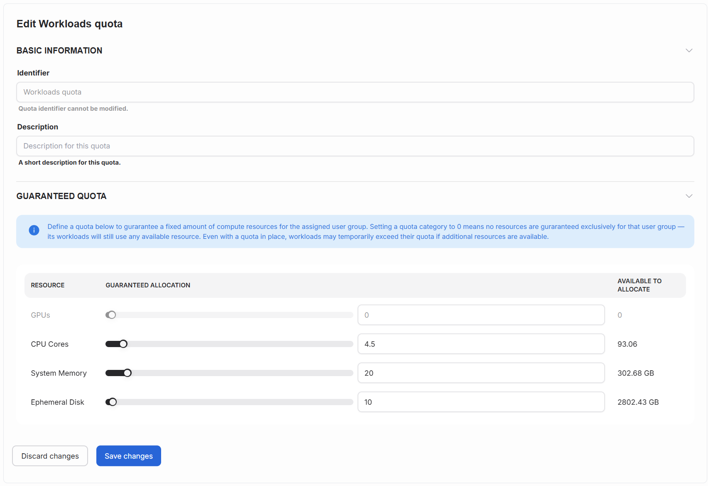

---
tags:
  - airman
  - quota
  - add quota
---

# Manage quotas

This article explains how to define quotas for your user groups. In Airman you can set quotas for GPU and CPUs for your user groups. Users belonging to a user group are guaranteed the allocated quota for their AI workloads.

!!! info
There can be only one quota for a group per cluster.

## Create quota

Press the `Create Quota` button to create a new quota.

**Cluster** - The cluster to which the quota applies to.

**Assignee** - The user group for the quota. A quota can be assigned to only one user group.

**Identifier** - Unique identifier for the quota.

**Description** - A optional description that describes the quota.

## Set the guaranteed quota values

Define a quota below to gurarantee a fixed amount of compute resources for the assigned user group. Setting a quota category to 0 means no resources are guraranteed exclusively for that user group — its workloads will still use any available resource. Even with a quota in place, workloads may temporarily exceed their quota if additional resources are available.

**GPUs** - The guaranteed allocation for the number of GPUs. "Available to allocate" shows the total amount available.

**CPU Cores** - The guaranteed allocation for the number of CPUs. "Available to allocate" shows the total amount available.

**System Memory** - The guaranteed allocation for the amount of memory (GB). "Available to allocate" shows the total amount available.

**Ephemeral Disk** - The guaranteed allocation for the amount of disk space (GB). "Available to allocate" shows the total amount available.

Press `Save changes` to finish creating the quota.

