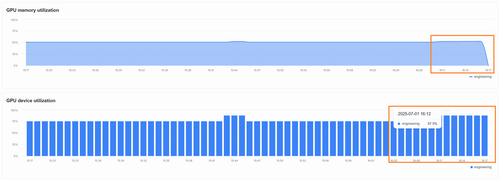
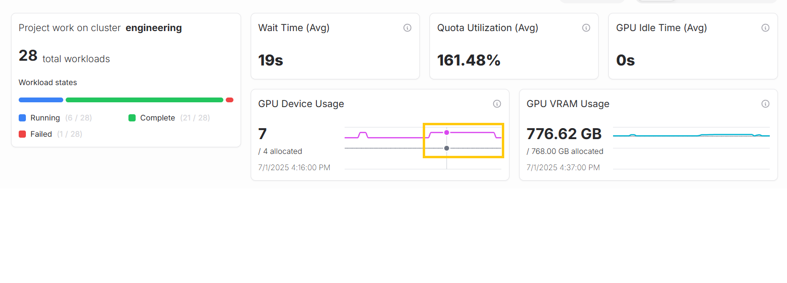

# Resource utilization of AI workloads

This guide teaches you how you can observe and manage the amount of resources that your AI workloads are using.

1. We first start a new AI workload in order to consume some resources
2. We then observe the amount of resources this AI workload is using by looking at the different dashboards in SiloGen AI Resource Manager.
3. Finally we look at how we can adjust the resource quotas.

## 1. Consume resources by running AI workloads
In order to consume some resources you can start a new AI workload that uses GPUs. For this purpose you can run a model finetuning workload by following the instructions in ["Model finetuning"](../../developer-center/training/fine-tuning.md). Once the workload has started you can go to the `Project dashboard` to observe the amount of GPUs and VRAM the workload is using.

You can see an example in the below picture.

## 2. Observe the change in resource utilization
Go to the `Dashboard` and select the "Last hour" time period to observe the change in resource consumption.
You can see that the resource utilization has increased due to the model finetuning workload.

You can see more details of the resource utilization on the `Project dashboard`.

## 3. Adjust the quota
In case your AI workloads are pending to get started you might need to allocate more resources for them. This is done by changing the project quota so you have more resources available.
