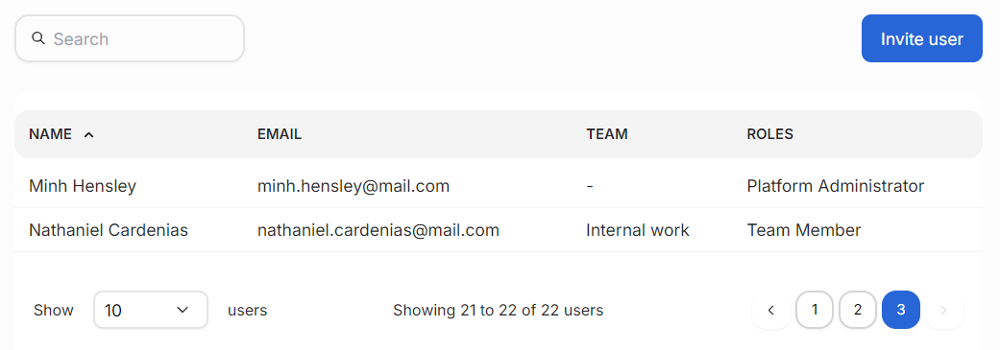
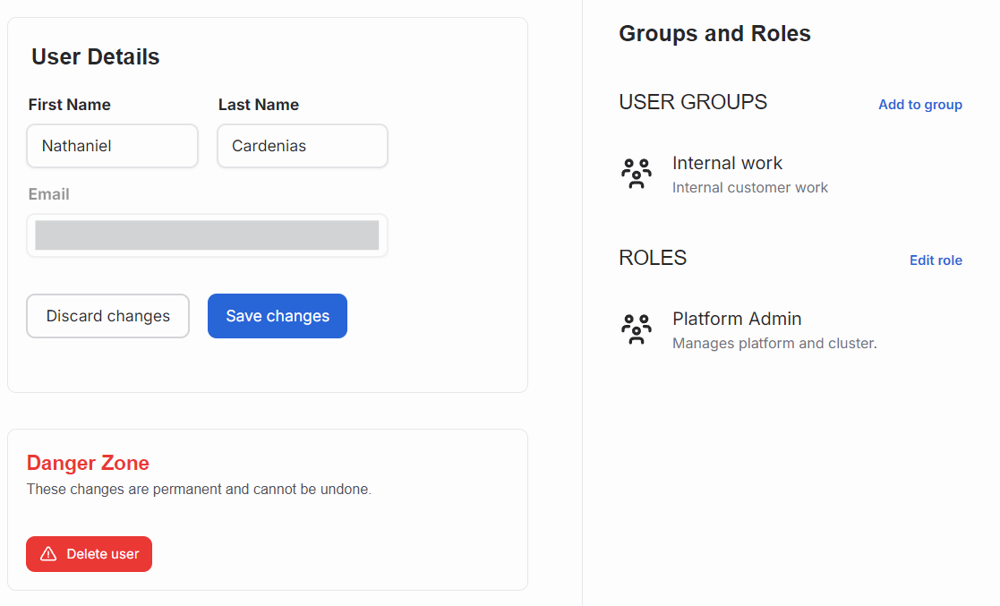

---
tags:
  - user management
  - invite users
  - airman
---

# Manage users

Users enter SiloGen platform with their email address that has been granted access. User management happens in Access control section found in the navigation.

## Main view

The main view of user management lists users with all relevant information related to them. Mainly the user's name and their email address inform who the user is and the role tells about their capabilities in the platform. Above the list is a search field capable of searching from name and address fields. Below the user list is a pagination used for navigating the user list.

## User view

When clicking the user's name in the list, the view switches to the user view. It displays a form for updating user's name. The users' email address cannot be changed in the platform. Click "Save changes" button to accept the update.

The right pane lists users assignments to different projects and their dedicated user role. User with proper user role can adjust individual users' projects or change their role.

## Invite users

Inviting new users happens in a special page or via the action button in User directory. The main view in Invited users view lists all of the invited users before they have accepted and activated their accounts. The invitation flow asks for user's email address, role, and a project.

Only users within allowed domains are accepted on the platform. Platform administrators can update organization's allowed domains.

### Organization with an identity provider

If the organization has an identity provider (IDP) linked and active, the user invitation functionality is disabled since it should be managed by the identity provider. Users can set up their system to use a identity provider with [these instructions](../../keycloak/sso.md).

### New user registetration with no identity provider

New users need to sign up for a SiloGen Keycloak account. With the account, users can sign in to the Chat UI or get an access token to use with the API.

- Go to https://auth.services.silogen.ai/realms/silogen/account/ (figure 1)
- Select “Sign In”, and then select “Register” (figure 2). Register with your company email.
- You will receive a confirmation email with confirmation link, the link is valid only 5 min
- Go to chat.services.silogen.ai and sign in with your account. After that your account is active and you can proceed with Chat UI or the API

The screenshots show you this registering process.

_Figure 1. Keycloak account manager: https://auth.services.silogen.ai/realms/silogen/account/_

_Figure 2. Register or sign in to your siloGen account_

## Delete users

In the bottom of the user edit page is an area called Danger zone. It contains a button for deleting the user account. Deleting an account is a permanent action, and shouldn't be done without proper consideration.

Only platform administrators can remove users.
