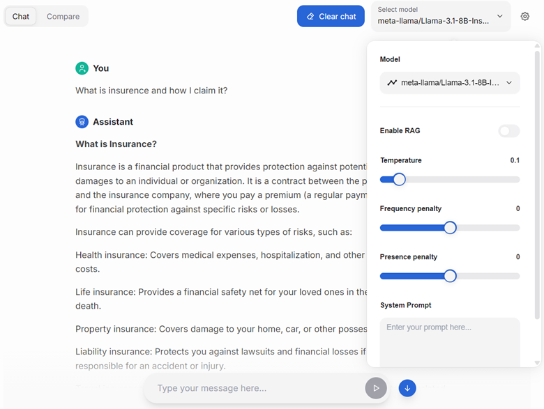

---
tags:
  - developer center
  - chat
  - rag
---

# Chat

The Chat page allows you to experiment with models you have access to. You can modify several retrieval and generation parameters to see how they affect the model's response.

## Accessing the Chat

Navigate to the **AI Developer Center** → `Chat and Compare` to access the Chat.

You will be able to choose from the list of models you have access to.

Expand the settings toggle to view and modify the retrieval and generation parameters, using the same format as for the API (e.g., [Changing prompt template for RAG](../../using-the-api/llm-service/changing-prompt-template.md)).

## Inspecting the debug output of the model

Once you have a response from the model, you can inspect the messages sent to the model, the context retrieved as part of RAG, and the consumed tokens by clicking the "bug" icon next to the response.

