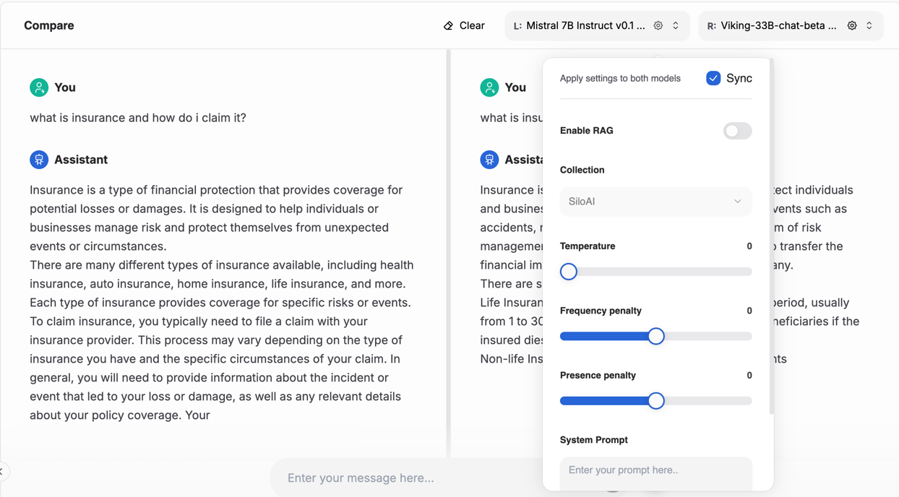

---
tags:
  - developer center
  - chat
  - comparison
---

# Comparison

The model comparison view allows you to compare the output of different models using the same set of settings.

A common use case is to compare the response of your model before and after fine-tuning, or to test how different settings affect the model's output.

## Accessing the model comparison

Navigate to the corresponding page in the **AI Developer Center** → `Chat and Compare` → `Compare` to access the Comparison.

You will be able to choose from the list of models you have access to.

Similar to the Chat, you can expand the settings toggle to view and modify the retrieval and generation parameters.

## Inspecting the debug output of the model

Also [similar to the chat](./chat.md#inspecting-the-debug-output-of-the-model), you can click the "bug" icon to inspect the messages sent to the model, the context retrieved as part of RAG, and the consumed tokens.

