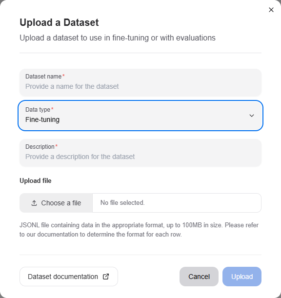
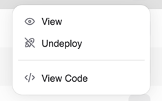
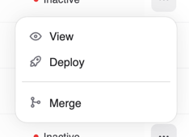
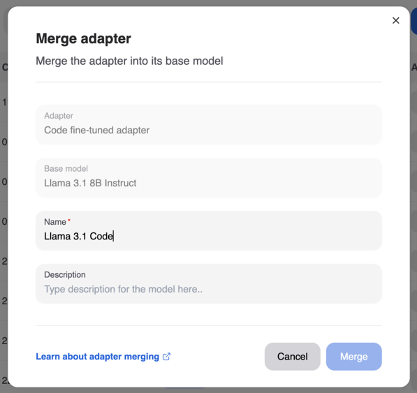

---
tags:
  - developer center
  - fine-tuning
---

# Fine-tuning

Fine-tuning a model allows you to customize it to your specific use-case with your data. We provide a certified list of base-models which you can fine-tune and we allow you to customize certain hyperparameters to get the best results.

Fine-tuned models can be deployed and subsequently be used for inferencing once weights for the model have been computed.

## Getting ready to fine-tune your model

### Uploading training data

One of the first steps to take towards fine-tuning your model is to upload training data to our platform. The training data should represent a wide range of indicative conversations that you would like your model to respond to as part of inference.

Once you have procured training data for your model, navigate to the "Datasets" page of the Developer Center to upload the dataset. We currently support uploading datasets in a JSONL format, where each row represents a separate chat conversation. The format of each row should correspond to what is defined in the [specification](./datasets.md#fine-tuning) for each datapoint.

Subsequently, click the "Upload" button and drop your JSONL file in with a name and description

### Base-models for fine-tuning

We continuously work to certify base-models for fine-tuning. It is recommended that you first identify a base-model appropriate for your use case and use that for fine-tuning. If you are missing a specific base-model, reach out to our customer success team in order for them to either provision access, or fast-track certification.

You can browse the list of accessible base-models by navigating back to the **AI Developer Center** → `Models` and clicking the "Create New" button.

## Creating a fine-tuned model

Now navigate to Models page. You can trigger the creation of your fine-tuned model by clicking the "Fine-Tune Model" button and selecting appropriate entries.

You must provide your model a name and can optionally specify a description and any of the three hyperparameters: batch-size, learning-rate multiplier and number of epochs. If you are unsure of the values to use, leave the fields empty, to auto-select the default certified values.

Once the fine-tuning process has successfully been triggered, you will be able to see your model in the "Not-deployed" tab of the page and the fine-tuning run itself in the "Run status" section. The fine-tuning run may take several hours to complete, so we recommend visiting the Developer Center occasionally when the run is in progress. If the run fails mid-way, please reach out to our customer success team, and we will help triage your issue.

## Deploying a fine-tuned model

Once your model has been successfully trained, the model status will reflect as "Ready": this means that the weights have been successfully computed for your model and it can be used for inferencing.

Click the "Deploy button" corresponding the model you would like to deploy, and have it usable for inferencing. Please note that a model once deployed can take upto 5 minutes before it can serve requests.

Once deployed, you can navigate either to the "Chat and Compare" page to converse with the model.

After your have verified that your model performs as per expectations, you can click the "View Code" menu item on the row on the Models page and use the code snippet for inferencing via the API.

## Undeploying a fine-tuned model

Once you have deployed a version of a fine-tuned model, it might be the case that you subsequently want to "Undeploy" it because it has been superseded by other model. You can do this by again navigating to the **AI Developer Center** → `Models`, identifying the model in the list of "Deployed" models and clicking the "Undeploy button".

This will make the model no longer accessible for inferencing.

## Adapter merging

While adapters allow you deploy multiple fine-tuned models in a cost efficient way, it comes at a penalty of performance: A deployment of an adapter will always be less performant than a deployment of a single model.

To enable usage of our fine-tuned models in a high performance use-case, we allow you to merge an adapter with the base model to create a new model with the merged weights. This new model can then be deployed independently of the base model.

To merge an adapter back into the base model, click the context menu of the adapter you would like to merge and click the "Merge" button. Provide a new unique name for the merged model and click "Merge".

Once the merge process is complete, the new model will be visible in the list of models.

You can view the details of the merge process in the "Run status" section of the page.

## Examples

[Run model fine-tuning workload through Kubernetes CLI](../../../../../../../ai-workloads/workloads/llm-finetune-silogen-engine/helm/README.md)

[Scalable fine-tuning](../../../../../../../ai-workloads/docs/tutorials/tutorial-01-deliver-resources-and-finetune.md)
