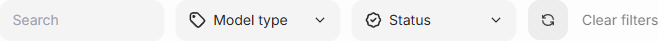
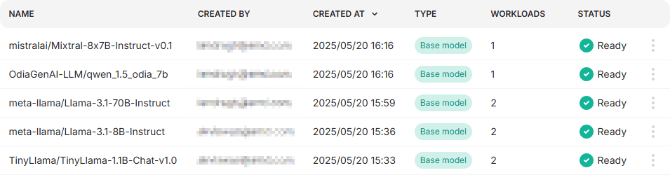
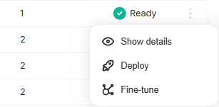

# Models

The Models view lists all available models than can be deployed or [fine-tuned](./fine-tuning.md).

The filter bar helps filtering down the model list. The model type and status are described more detailed under [Defitions](#definitions).

Models list always shows models mathing the current filter values.

Model specific actions can be performed using the three dot menu button.

## Definitions

### Model type

Model type is one of the following

- **Base model**
- **Merged model**
- **Adapter**

### Model status

Model can be in one of the following states

- **Pending**: Model is being prepared
- **Ready**: Model is ready for use
- **Failed**: There was some issue loading the model and model is not available for use.
