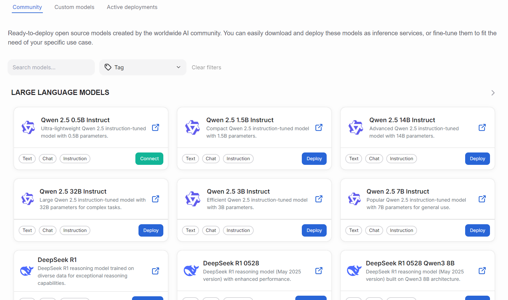

# Models

The Models view lists all available models than can be deployed or [fine-tuned](./fine-tuning.md).

The view is divided to three different subpages: community models, custom models and active deployments. The **Community** models page lists available industry standard models, such as common large language models. **Custom models** page lists all available custom models and fine-tuned models. **Active deployments** lists deployed models and their statuses.

## Definitions

Model can be one of the following types:

- **Base model**: A foundation model trained with a vast amounts of data.
- **Merged model**: A model that has been improved for specific use cases.
- **Adapter**: Small modules that alter the base model behavior.

Model can be in one of the following states:

- **Pending**: Model is being prepared.
- **Ready**: Model is ready for use.
- **Failed**: There was some issue loading the model and model is not available for use.

## Subpage: Community models

All of the available ready-to-deploy open source models are listed in this view. Users can filter the list by using the available search field and tags dropdown.

The model boxes contain helpful information about the models. Along the name users can click a link, which takes them to the external model webpage. Each model has also a short description and tags.

The models contain an action button which can be one of the following:

- **Download**: Downloads a base model into the custom models catalog.
- **Fine-tune**: Fine-tune a model that is eligible for that. Read more about [fine-tuning](./fine-tuning.md).
- **Deploy**: Prepares the model into use.
- **Connect**: Opens a set of parameters that can be used for connecting your applications to the model. For chattable models, let's you take the model into the chat window.

The platform's development team maintains the available community models.

## Subpage: Custom models

The custom models page lists all of the available custom models activated from the community models page.

!!! warning
    Custom models page does not currently allow the implementation of users' own models, such as own business intelligence solutions.

The page has a prominent **Fine-tune model** button which opens the [fine-tuning](./fine-tuning.md) dialog. Click each model's action menu shows a list of available function: show details, fine-tune, deploy or delete.

- **Show details** opens a dialog containing relevant information.
- **Fine-tune** action opens the fine-tuningn dialog.
- **Deploy** opens the a drawer which instructs user in deploying the model for use.
- **Delete** action let's users delete their models. We advice caution when using this action, since it is irreversible.

## Subpage: Active deployments

The view lists active models that are deployed into the cluster. Each model is associated with a lifetime status.

From the actions menus users can view model details or delete the models. Filter bar offers various ways to select a subset of models for viewing.

