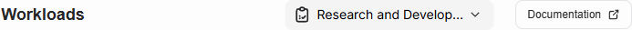

# Workloads

A workload is a batch job or a service running in the cluster with resources defined by the workload and limited by the quota that the workload owner has. This page shows all started workloads. View shows all workload statuses by default except `Deleted`.

If a user belongs to multiple projects, the project needs to be selected first from the top of the page.

The paginated table shows the name of the workload, the cluster the workload is assigned to, and how many resources the workload requires. The `Status` column shows the last known status of the workload and is not updated automatically. Filters can be used for find workload by name, type or status.

## Actions

Workload actions are available from the Actions column by pressing the three dot button.

### Show details

Shows details of the workload like when workload was created and by who.

### Delete

Queues the workload for deletion.

### Open Workspace

If workload type is `Workspace`, selecting this action opens the workspace into a new browser tab.

## Workload types

| Type               | Description                                                   |
| ------------------ | ------------------------------------------------------------- |
| **Model Download** | Batch job for downloading a new AI model                      |
| **Inference**      | Inference service                                             |
| **Training**       | Model training batch job which generates a new model          |
| **Pre-Training**   | Model pre-training batch job which generates a new base model |
| **Fine-Tuning**    | Model fine-tuning batch job which generates a new model       |
| **Evaluation**     | Workload for evaluating model performance                     |
| **Workspace**      | Workspace is for model experiments                            |

## Workload statuses

| Status               | Description                                       |
| -------------------- | ------------------------------------------------- |
| **Added**            | Workload has been created                         |
| **Pending**          | Waiting for start                                 |
| **Running**          | Workload is being executed                        |
| **Complete**         | Workload has finished succesfully                 |
| **Failed**           | Error has occured and workload did not complete   |
| **Delete Requested** | Workload is queue for removal                     |
| **Deleted**          | Workload succesfully deleted                      |
| **Delete Failed**    | Delete failed and manual cleaning might be needed |
| **Terminated**       | Executiona has been terminated                    |
| **Unknown**          | Status cannot be determined                       |
