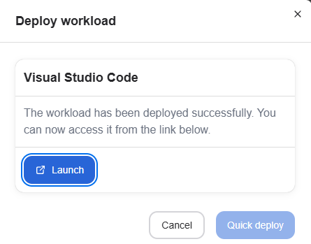

---
tags:
  - developer center
  - workspaces
  - workload
---

# Workspaces

Workspaces contain different kinds of interactive environments optimized for AMD compute. For example, JupyterLab and Visual Studio Code workspaces allow users to leverage the power of the cluster with zero configuration on the client computer.

## Deploy a workspace

You can deploy a workload by clicking `View and deploy`, which opens the workload deployment view.

From the deployment view, you can change the workload name if you want to. The default resource allocation should be sufficient for most workspaces, but it is possible to customize these settings if needed.

Once the values have been set, press `Quick deploy` to deploy the workspace. It takes a while for the workspace to start, but once it has started, the deployment overlay will show a `Launch` button, which can be used to access the workspace. The workspace can also be accessed later from the [Workloads](./workloads.md#open-workspace) page.

