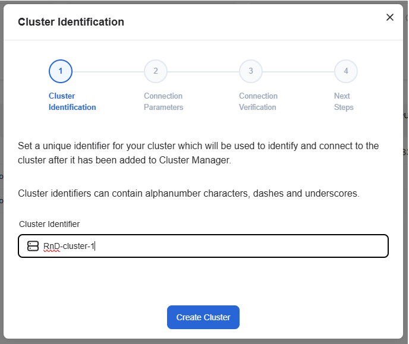

<!--
Copyright © Advanced Micro Devices, Inc., or its affiliates.

SPDX-License-Identifier: MIT
-->

---
tags:
  - AMD Resource Manager
  - cluster
  - add cluster
---

# Create a New Cluster in the UI

This article explains how to create a new cluster in the AMD Resource Manager user interface.

To add a new cluster:

1. Click the "Add Cluster" button.
2. Cluster identification - Set a unique identifier for your cluster.
3. Set the connection parameters and click the "Verify Connection" button.
4. Verify connection - Wait for the connection verification to complete.
5. Complete the next steps in the process.

## Delete a cluster

1. Select the cluster you want to delete.
2. Click "Delete" in the right menu of the selected cluster.
