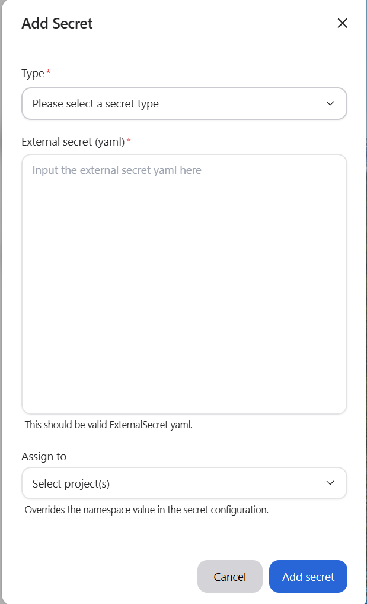
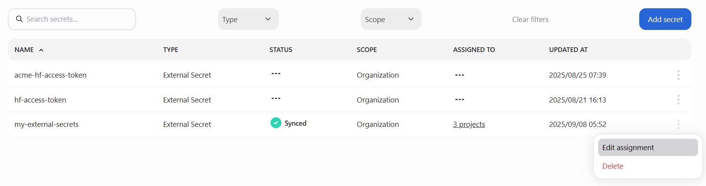
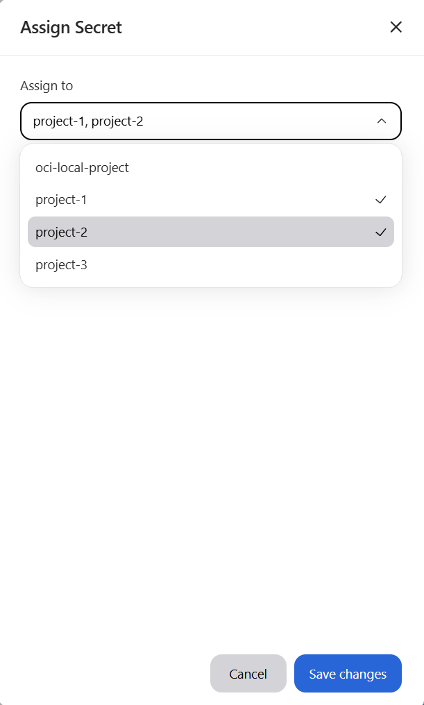
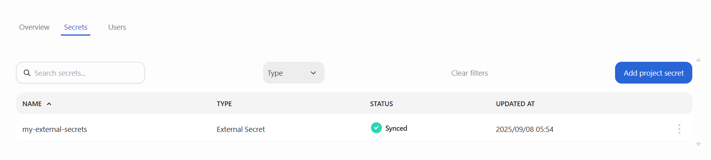

<!--
Copyright © Advanced Micro Devices, Inc., or its affiliates.

SPDX-License-Identifier: MIT
-->

---
tags:
  - secrets
  - AMD Resource Manager
---

# Manage Secrets

Secrets in the platform provide a secure way to store sensitive information such as API keys, database credentials, or tokens. They are created at the organizational level and can then be assigned to one or more projects. This ensures workloads always have the credentials they need without exposing them directly in code or manifests.

## Secrets page

The main secrets page displays all secrets in your organization. Each entry includes key details such as the secret’s name, type, current status, scope, assigned projects, and last updated time. You can filter or search secrets by name or type, and use pagination to browse through the list.


### Secrets table

| Column         | Description                                                                 |
| -------------- | --------------------------------------------------------------------------- |
| **Name**       | The unique name of the secret                                               |
| **Type**       | The kind of secret (e.g., ExternalSecret, Kubernetes Secret)                |
| **Status**     | The current synchronization state (e.g., Pending, Synced, Failed)           |
| **Scope**      | Indicates whether the secret is organizational or project-specific          |
| **Assigned to**| Lists the projects currently using the secret                               |
| **Updated at** | The timestamp of the last modification or synchronization                   |
| **Actions**    | Available operations such as *Edit Assignments* or *Delete*                 |

## Add secrets

To create a new secret, click the **Add secret** button on the main view. This opens the **Add secret** modal, where you can enter the details for the new secret.



In the modal, provide the following information:

- **Type**: The type of secret (e.g., ExternalSecret)
- **External Secret (YAML)**: A valid Kubernetes-style YAML manifest defining the secret (see example below)
- **Assigned to**: (Optional) Projects to immediately assign the secret to

Secrets must follow naming rules: lowercase letters, numbers, and dashes only (no spaces or special characters). The secret name defined in the YAML must be unique within the organization.

### Example ExternalSecret manifest

```yaml
apiVersion: external-secrets.io/v1
kind: ExternalSecret
metadata:
  name: my-secret
spec:
  refreshInterval: 1h
  secretStoreRef:
    kind: ClusterSecretStore
    name: vault-backend-dev
  target:
    name: my-secret
    creationPolicy: Owner
  data:
    - secretKey: db-password
      remoteRef:
        key: prod/database
        property: password
```

> **Important:** When creating an ExternalSecret, the referenced `ClusterSecretStore` must already exist in the cluster. Without it, the ExternalSecret cannot fetch values from the external provider. See the [External Secrets Operator documentation](https://external-secrets.io/latest/) for details on how to configure `ClusterSecretStore` for providers such as Vault, AWS, GCP, and Azure.

## Assign secrets to projects

Secrets can be securely shared across projects. Assigning a secret ensures it is synchronized to that project’s namespace in all relevant clusters.

To edit project assignments, click the **actions menu** (⋮) at the end of the secret’s row and select **Edit assignment**. This opens the **Assign secret** modal, which displays a list of available projects:





- To **assign** the secret, select the projects you want from the list.
- To **remove** an assignment, deselect any projects that are already checked.

When finished, click **Save changes** to apply your updates.

!!! note
    Project assignments are disabled while a secret is being updated or deleted. You must wait until the operation is complete before editing assignments.

## Delete secrets

To permanently delete a secret from the organization (and remove it from all assigned projects and synchronized clusters), open the **actions menu** (⋮) on the secret’s row and select **Delete**. This opens a confirmation modal where you must confirm the deletion. Click **Delete** to proceed.


- **Deleting a secret permanently removes it from all projects and clusters.**
- This action cannot be undone.
- Only platform administrators are allowed to delete secrets.

## View secrets within a project

In addition to the main **Secrets page**, you can also view secrets from within an individual project. Each project has its own **Secrets tab**, which lists only the secrets assigned to that project.



The project-level secrets view includes the following information:

- **Name**: The name of the secret assigned to the project
- **Type**: The kind of secret (e.g., ExternalSecret)
- **Status**: The synchronization status for the secret in that project’s namespace
- **Updated At**: The most recent time the secret was modified or synchronized

This view is useful for quickly confirming which secrets are available to workloads in a specific project without needing to navigate through the organization-wide Secrets page.

> **Note**
> - When creating a secret from the **Secrets tab**, it is automatically assigned to the current project. You will not be able to assign it to additional projects during creation.
> - Deleting from a project’s Secrets tab only unassigns the secret from that project. Use the main Secrets page to delete it from the entire organization.
> - To permanently delete a secret from the entire organization and all clusters/projects, you must delete it from the main **Secrets page**.

## Secret statuses

For a full list of possible synchronization states, see the [Secret statuses](../secrets/overview.md#secret-statuses) section in the Secrets overview.
