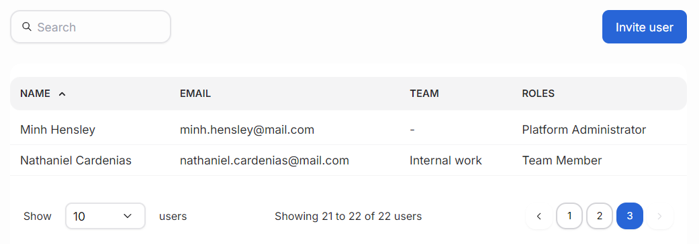
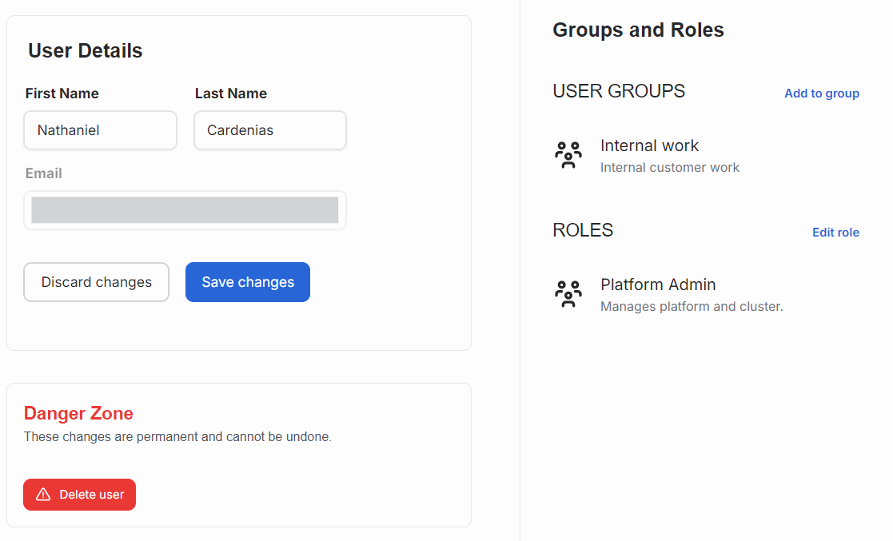
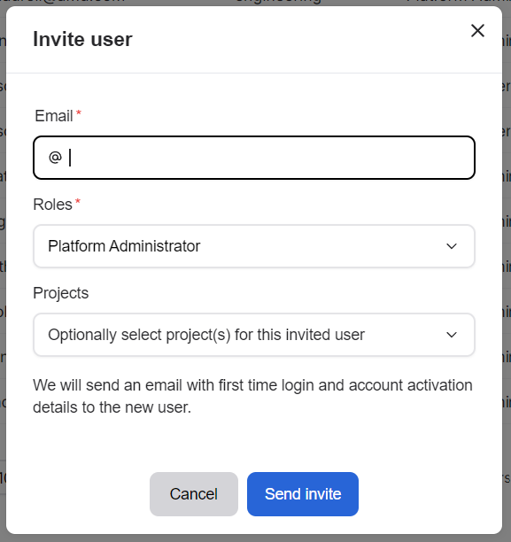

---
tags:
  - user management
  - invite users
  - AMD Resource Manager
---
<!--
Copyright © Advanced Micro Devices, Inc., or its affiliates.

SPDX-License-Identifier: MIT
-->

# Manage Users

Users enter the {{ name_secondary }} with their email address after being granted access. User management takes place in the Access control section found in the navigation.

## Main view

The main user management view lists users with all relevant information. The user's name and email address identify who the user is, and the role indicates their capabilities on the platform. The projects column shows the project the user belongs to. If there is more than one project, hovering over the project name will show all of them. Above the list is a search field that can search by name and address. Below the user list is pagination for navigating the user list.

## User view

Clicking a user's name in the list switches to the user view. It displays a form for updating the user's name. The user's email address cannot be changed in the platform. Click the "Save changes" button to apply the update.

The right pane lists the user's assignments to different projects and their dedicated user role. Users with the appropriate role can adjust individual users' projects or change their role.

## Invite users

Inviting new users happens on a special page or via the action button in the User directory. The main view in the Invited users section lists all invited users before they have accepted and activated their accounts. The invitation flow asks for the user's email address, role, and a project they should be assigned to.

Only users within allowed domains are accepted on the platform. Platform administrators can update the organization's allowed domains.

### Organization with an identity provider

If the organization has an identity provider (IDP) linked and active, the user invitation functionality is disabled, as user management is handled by the identity provider. Users can set up their system to use an identity provider with [these instructions](../../keycloak/sso.md).

## Delete users

At the bottom of the user edit page is an area called the Danger zone. It contains a button for deleting the user account. Deleting an account is a permanent action and should not be done without proper consideration.

Only platform administrators can remove users.
