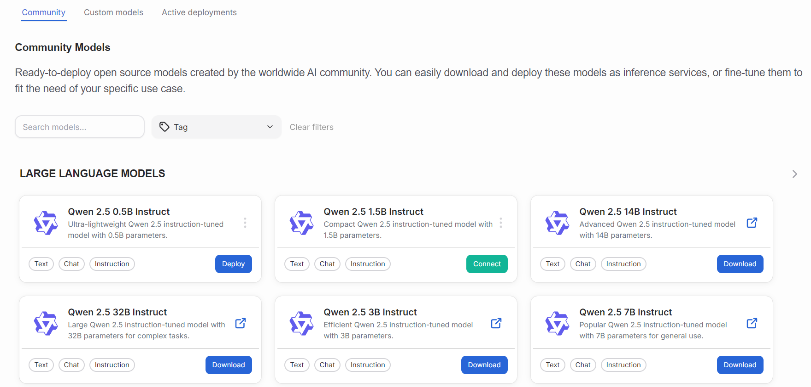
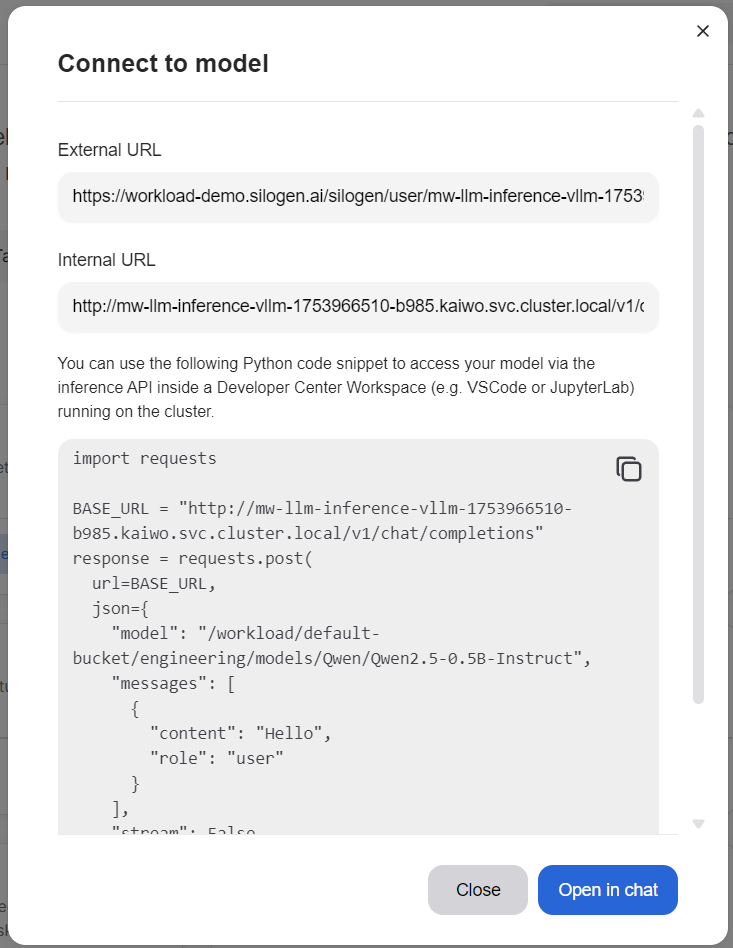
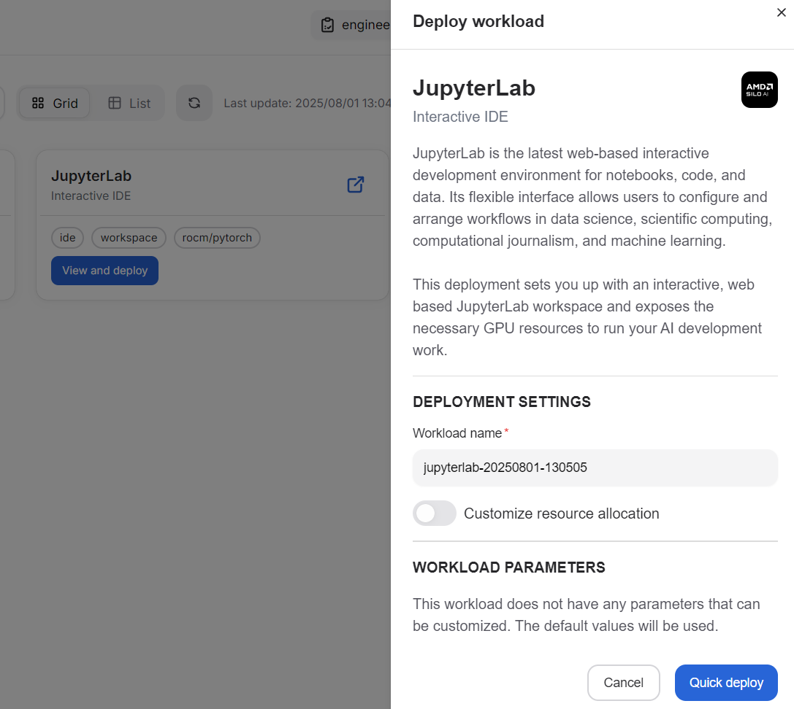
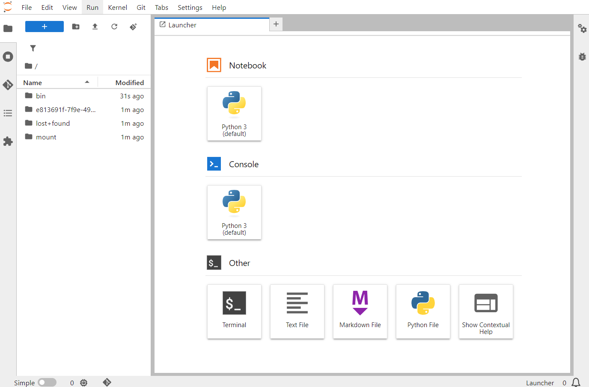
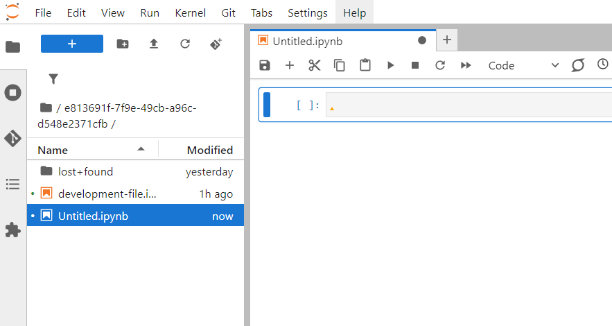

---
tags:
  - AMD AI Workbench
  - deploy
  - models
  - inference
  - tutorial
---

# How to deploy a model and run inference

Training AI models and developing your own models are essential parts of AI workflows, but eventually they lead to using the models in your business applications. Solving problems, making predictions, and processing data is called inference. This is the culmination of AI workflows, providing you with business value.

In short, an AI model requires data for training it properly. The model applies learned patterns to analyze new inputs. With new data, the model generates predictions, classifications, or other types of responses. In the end, the results are used to make decisions and provide services.

This tutorial takes you through the following steps. Utilizing AI models in business applications is essential in any AI development workflow. This simple tutorial guides you to pick a model, deploy it and trial its endpoints in Jupyter. This tutorial takes you through the following steps:

1. Deploy a model from the model catalog.
2. Find information about the model endpoints.
3. Connect to a model endpoint for inference.

## 1. Deploy a model

Navigate to the `Models` page and find a model with the tag **Instruction**. Chat models are fun, but their responses can be too conversational and not very helpful for specific tasks. Instruction models are fine-tuned to be helpful and try to answer questions or act based on the given instructions.

One of these models is Qwen 2.5 1.5B Instruct (note that it has the word "Instruct" in the name), but you can pick any of the available ones. If it isn't already downloaded, click the **Download** button. The download might take a while.

Otherwise, proceed with deploying the model by clicking **Deploy**. No need to update any deployment parameters. This might take a while, so it's better to stretch your legs or do something else in the meantime. You can follow the deployment progress on the `Workloads` page or the `Active deployments` page.

The community models page provides you with a variety of AI models with different capabilities. You can use the filters to find interesting models for your inference needs.

## 2. Find model endpoints

You can find model information on the `Community` page. Find the deployed model and it should have a "Connect" button. Clicking it reveals a dialog window giving you the required information for connecting to the model for inference.

**External URL** is the address you need for connections outside of your current platform.

**Internal URL** is the address that is used for connections inside your current platform.

The content box holds sample code for testing out the model. Click the copy button in the top right corner. The copy button looks like two overlaid squares.

If you want to end the tutorial here, you can just click the "Open in chat" button and continue with testing your new AI model.

## 3. Connect to the endpoint

To test the model endpoints, the easiest way is to go to the `Workspaces` page. On the page, look for **JupyterLab** and click "View and deploy". To keep things simple, click "Quick deploy" at the bottom of the newly opened drawer. You can change the name or allocated resources, but those aren't necessary for testing the workspace.

After the short deployment process, you can click the "Launch" button either in the drawer or, if you closed it, on the Workspaces page. This will open a JupyterLab browser tab, where you can run Python code or do other types of development inside the platform.

Be sure to open the directory named with a UUID. This directory's contents shouldn't be wiped if something unexpected happens to the JupyterLab deployment. Click the "Python 3" square in the right side pane. This will create an empty Python file; in JupyterLab these are called Python notebooks. You can name the file by right-clicking the filename in the left file list or in the tab above the code window.

Paste the previously copied Python code into the code window. A few notes about the code:
- BASE_URL is the internal URL mentioned previously in the connection parameter dialog window.
- The JSON area has a few lines of note:
  - "model" is the model's name prepended with a path to the model.
  - "messages" "content" is a message sent to the chat model.

Click the play/run button in the top area of the code window. The button looks like a right-facing triangle. This sends the message contents to the model and returns a response formatted in JSON format. In the response, you can spot a line titled 'content'. This is the chat response from the model.

For a nice greeting "Hello", the chat model should answer you with something nice as a response. You can change the "content" field in the initial JSON, click the play/run button once more, and expect another kind of response.

You should be able to use the same code in external applications. Just be sure to replace the BASE_URL variable with the external URL found in the connection parameters. This concludes the tutorial.
