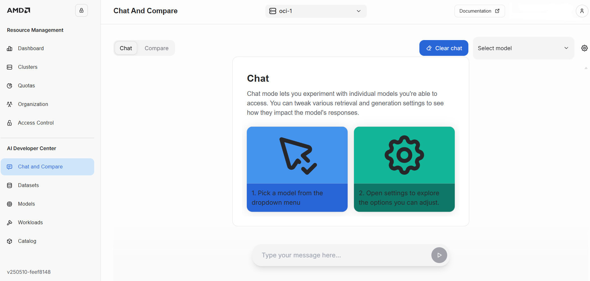

---
tags:
  - AMD AI Workbench
  - model catalog
  - workloads
---
<!--
Copyright © Advanced Micro Devices, Inc., or its affiliates.

SPDX-License-Identifier: MIT
-->
# AMD AI Workbench Overview

The AMD AI Workbench is an interface for developers to easily manage the lifecycle of their AI stack. The Workbench provides an easy-to-use low-code option for running and managing AI workloads. This article lays the foundation for how to develop, run, and manage AI workloads in the AMD AI Workbench.

## AMD AI Workbench functionality

The AMD AI Workbench includes the following capabilities:

### Model catalog

The AMD AI Workbench offers a comprehensive [catalog](../workbench/training/models.md) of curated open-source models, including state-of-the-art large language models (LLMs) and image/video generation models. Developers can easily discover, fine-tune, and deploy these models for their AI use cases.

### AI workspaces

The AMD AI Workbench provides developers with [tools and frameworks](./workspaces.md) and easy-access to GPU-resources in order to accelerate AI development and experimentation, featuring a comprehensive catalog of optimized AI workloads and models for AMD compute. The workloads include the most common developer tools and frameworks, such as Jupyter Notebooks, Visual Studio Code, and popular frameworks like PyTorch and TensorFlow.

### Training & fine-tuning

[Fine-tuning](./training/fine-tuning.md) a model allows developers to customize it for their specific use case and data. AMD AI Workbench provides a certified list of base models that developers can fine-tune, and allows customization of certain hyperparameters to achieve the best results.

### Chat and compare

The [chat page](./inference/chat.md) allows developers to experiment with models they have access to. Developers can modify generation parameters to see how they affect the model's response. The [model comparison](./inference/compare.md) view allows developers to compare the output of different models using the same set of settings.

### GPU-as-a-Service

The AMD AI Workbench provides developers with self-service access to workspaces with GPU resources. Platform admins can set project quotas for GPU usage so teams always have the right amount of resources available.

## Running AI workloads on the command-line

Developers can also deploy and run AI workloads through the command-line interface using `kubectl`. The [AI workloads](https://github.com/silogen/ai-workloads) are pre-validated, open-source and continuously updated.

See more details on how to run workloads on the [command-line](../../../../ai-workloads-manifests/workloads-overview/).
