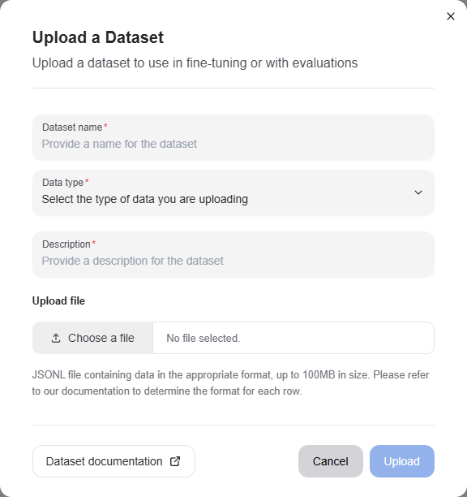

<!--
Copyright © Advanced Micro Devices, Inc., or its affiliates.

SPDX-License-Identifier: MIT
-->

---
tags:
  - AMD AI Workbench
  - datasets
  - fine-tuning
---

# Datasets

AMD AI Workbench allows you to create and manage datasets on the platform for fine-tuning purposes. Datasets are collections of data points, where each data point represents a conversation, with or without the model's expected response, depending on the use case.

## Uploading a dataset

Navigate to the `Datasets` page to upload a dataset. You can provide a name and description for the dataset, and upload a file in JSONL format.

The type of dataset should be selected when uploading the file, and the format of each row should correspond to the selected dataset type.



## Data formats

Depending on the selected dataset type, each row in the JSONL file should be formatted as shown below.

!!! info JSONL formatting
    In a real JSONL file, each object must be on a single line. Here, objects are formatted for readability.

### Fine-tuning

```json
{
  "messages": [
    {
      "role": "system",
      "content": "You are a helpful Geography bot. Only answer questions about Geography."
    },
    { "role": "user", "content": "What is the capital of France?" },
    { "role": "assistant", "content": "Paris" }
  ]
}
```

### Direct preference

```json
{
  "prompt_messages": [
    {
      "role": "system",
      "content": "You are a helpful Geography bot. Only answer questions about Geography."
    },
    { "role": "user", "content": "What is the capital of France?" }
  ],
  "chosen_messages": [{ "role": "assistant", "content": "Paris" }],
  "rejected_messages": [{ "role": "assistant", "content": "I do not know" }]
}
```

### Unarchiving datasets

If you have identified a dataset that is no longer relevant to your use cases, you can choose to delete. This happens by selecting the dataset(s) and clicking the "Delete" button in the actions menu.


