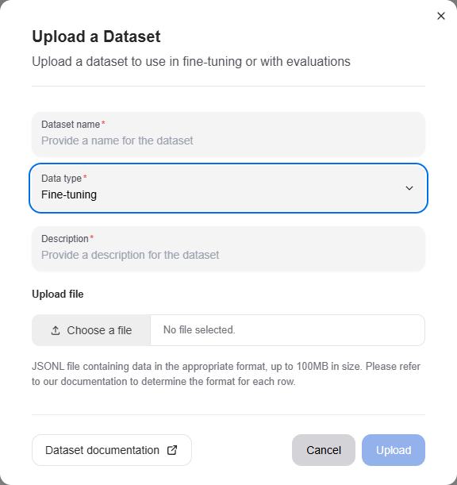
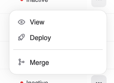
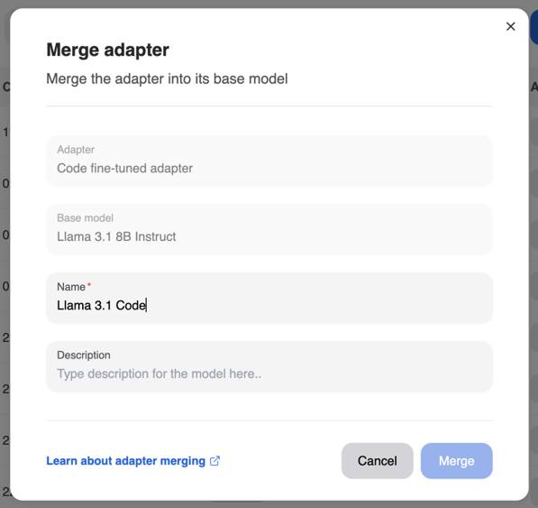

---
tags:
  - AMD AI Workbench
  - fine-tuning
---
<!--
Copyright © Advanced Micro Devices, Inc., or its affiliates.

SPDX-License-Identifier: MIT
-->
# Fine-tuning

Fine-tuning a model allows you to customize it for your specific use case with your data. We provide a certified list of base models that you can fine-tune, and allow you to customize certain hyperparameters to achieve the best results.

Fine-tuned models can be deployed and subsequently used for inference once the model weights have been computed.

## Getting ready to fine-tune your model

### Uploading training data

One of the first steps toward fine-tuning your model is to upload training data to our platform. The training data should represent a wide range of conversations that you would like your model to respond to as part of inference.

Once you have procured training data for your model, navigate to the "Datasets" page of the AMD AI Workbench to upload the dataset. We currently support uploading datasets in a JSONL format, where each row represents a separate chat conversation. The format of each row should correspond to what is defined in the [specification](./datasets.md#fine-tuning) for each datapoint.

Click the "Upload" button and drop your JSONL file in, providing a name and description.

### Base models for fine-tuning

We continuously work to certify base models for fine-tuning. It is recommended that you first identify a base model appropriate for your use case and use that for fine-tuning. If you are missing a specific base model, reach out to our customer success team so they can either provision access or fast-track certification.

You can browse the list of accessible base models by navigating back to the `Models` page and clicking the "Create New" button.

## Creating a fine-tuned model

Navigate to the Models page. You can trigger the creation of your fine-tuned model by clicking the "Fine-Tune Model" button and selecting the appropriate entries.

You must provide your model a name and can optionally specify a description and any of the three hyperparameters: batch size, learning rate multiplier, and number of epochs. If you are unsure of the values to use, leave the fields empty to auto-select the default certified values.

Once the fine-tuning process has been successfully triggered, you will be able to see your model in the "Not-deployed" tab of the page and the fine-tuning run itself in the "Run status" section. The fine-tuning run may take several hours to complete, so we recommend visiting the AMD AI Workbench occasionally while the run is in progress. If the run fails mid-way, please reach out to our customer success team, and we will help triage your issue.

## Deploying a fine-tuned model

Once your model has been successfully trained, the model status will reflect as "Ready". This means that the weights have been successfully computed for your model and it can be used for inferencing.

Click the "Deploy" button corresponding to the model you would like to deploy to make it available for inferencing. Please note that a model, once deployed, can take up to 5 minutes before it can serve requests.

Once deployed, you can navigate to the "Chat and Compare" page to converse with the model.

After you have verified that your model performs as expected, you can click the "View Code" menu item on the row in the Models page and use the code snippet for inference via the API.

## Undeploying a fine-tuned model

Once you have deployed a version of a fine-tuned model, you might want to "Undeploy" it if it has been superseded by another model. You can do this by navigating to the `Models` page, identifying the model in the list of "Deployed" models, and clicking the "Undeploy" button.

This will make the model no longer accessible for inferencing.

## Adapter merging

While adapters allow you to deploy multiple fine-tuned models in a cost-efficient way, this comes at a performance penalty. A deployment using an adapter will always be less performant than a deployment of a single model.

To enable high-performance use of our fine-tuned models, we allow you to merge an adapter with the base model to create a new model with merged weights. This new model can then be deployed independently of the base model.

To merge an adapter back into the base model, click the context menu of the adapter you would like to merge and click the "Merge" button. Provide a new unique name for the merged model and click "Merge."

Once the merge process is complete, the new model will be visible in the list of models.

You can view the details of the merge process in the "Run status" section of the page.

## Examples

- [Run model fine-tuning workload through Kubernetes CLI](../../../../../ai-workloads-manifests/llm-finetune-silogen-engine/helm/)
- [Scalable fine-tuning](../../../../../ai-workloads-docs/tutorials/tutorial-01-deliver-resources-and-finetune/)
