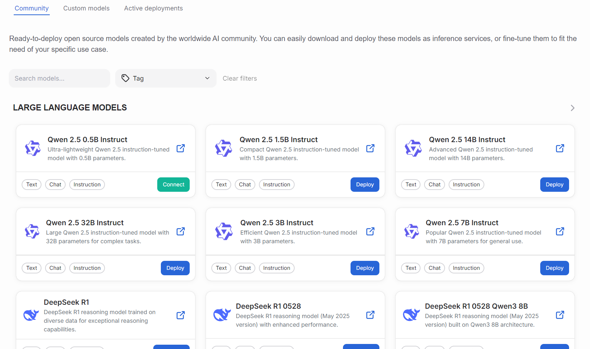
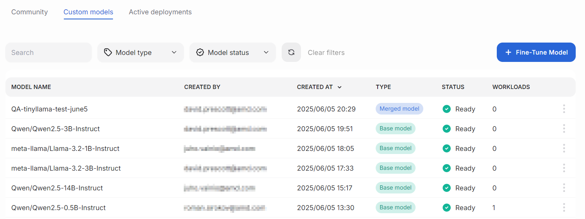
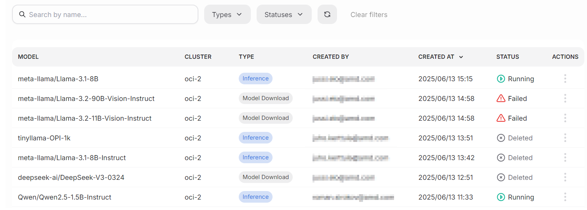

---
tags:
  - AMD AI Workbench
  - model catalog
  - deployments
---

# Models

The Models view lists all available models that can be deployed or [fine-tuned](./fine-tuning.md).

The view is divided into three different subpages: community models, custom models, and active deployments. The **Community** page lists available industry-standard models, such as common large language models. The **Custom models** page lists all available custom and fine-tuned models. **Active deployments** lists deployed models and their statuses.

## Definitions

A model can be one of the following types:

- **Base model**: A foundation model trained with vast amounts of data.
- **Merged model**: A model that has been improved for specific use cases.
- **Adapter**: Small modules that alter the base model's behavior.

Model can be in one of the following states:

- **Pending**: The model is being prepared.
- **Ready**: The model is ready for use.
- **Failed**: There was an issue loading the model, and it is not available for use.

## Subpage: Community models

All available ready-to-deploy open-source models are listed in this view. Users can filter the list using the search field and tags dropdown.

The models are hand-picked from Hugging Face and the download procedure fetches the model from the HF repository. The community models aren't modified in any way, but they are ensured to work well on AMD hardware. Some of the models might have modifications to how they use the provided compute resources.

The model boxes contain helpful information about each model. Along with the name, users can click a link to the external model webpage. Each model also has a short description and tags.

The models contain an action button, which can be one of the following:

- **Download**: Downloads a base model into the custom models catalog.
- **Fine-tune**: Fine-tune a model that is eligible for it. Read more about [fine-tuning](./fine-tuning.md).
- **Deploy**: Prepares the model for use.
- **Connect**: Opens a set of parameters that can be used for connecting your applications to the model. For chattable models, this lets you use the model in the chat window.

The platform's development team maintains the available community models.

## Subpage: Custom models

The custom models page lists all available custom models activated from the community models page.

!!! warning
    The custom models page does not currently allow the implementation of users' own models, such as custom business intelligence solutions.

The page has a prominent **Fine-tune model** button, which opens the [fine-tuning](./fine-tuning.md) dialog. Clicking each model's action menu shows a list of available functions: show details, fine-tune, deploy, or delete.

- **Show details** opens a dialog containing relevant information.
- **Fine-tune** opens the fine-tuning dialog.
- **Deploy** opens a drawer that instructs the user on deploying the model for use.
- **Delete** lets users delete their models. We advise caution when using this action, as it is irreversible.

## Subpage: Active deployments

This view lists active models that are deployed into the cluster. Each model has a status, describing its state.

From the actions menu, users can view model details or delete models. The filter bar offers various ways to select a subset of models.

