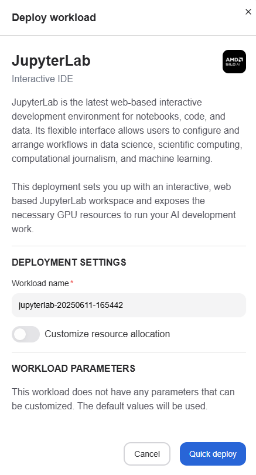
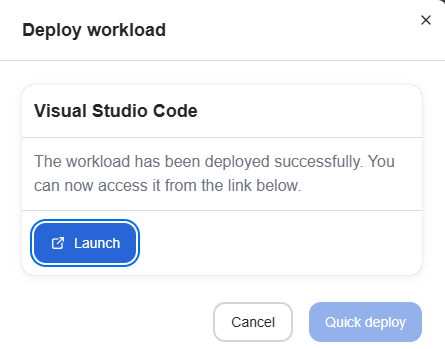

<!--
Copyright © Advanced Micro Devices, Inc., or its affiliates.

SPDX-License-Identifier: MIT
-->

---
tags:
  - AMD AI Workbench
  - workspaces
  - workloads
---

# Workspaces

Workspaces provide different kinds of interactive environments optimized for AMD compute. For example, JupyterLab and Visual Studio Code workspaces allow users to leverage the power of the cluster with zero configuration on the client computer.

## Deploy a workspace

You can deploy a workspace by clicking "View and deploy", which opens the workload deployment view.

From the deployment view, you can change the workspace name if you wish. The default resource allocation should be sufficient for most workspaces, but it is possible to customize these settings if needed.

Once the values have been set, press "Quick deploy" to deploy the workspace. It may take a while for the workspace to start, but once it has started, the deployment overlay will show a "Launch" button, which can be used to access the workspace. The workspace can also be accessed later from the [workloads](./workloads.md#open-workspace) page.

## Workspace Scoping

Workspaces are categorized by their scope, which determines how they're shared and limited within projects:

### Project-Scoped Workspaces

Some workspace types are project-scoped, meaning:

- **One per project**: Only one workspace of this type can be active (running or pending) per project at any time
- **Shared access**: All project members can access the same workspace instance
- **Creation limits**: Attempting to create a second workspace of the same type will result in an error until the existing one completes or fails

### User-Scoped Workspaces

Other workspace types are user-scoped, meaning:

- **Individual ownership**: Each user creates and owns their workspace instances
- **Multiple instances**: Users can create multiple workspaces of these types simultaneously
