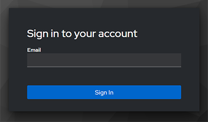
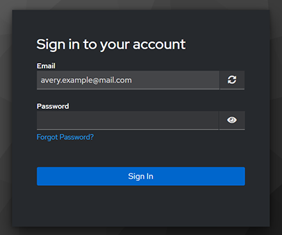

<!--
Copyright © Advanced Micro Devices, Inc., or its affiliates.

SPDX-License-Identifier: MIT
-->

```{tags} login, keycloak
```

# Login to the platform

Users log in to the platform at their dedicated URL address, for example, `your-domain.ai`. Entering the address in your browser's address bar takes you to the login page. The page has a button called "Sign in with Keycloak," which takes you to the authentication service.



Enter your email address in the specified field and click the "Sign In" button to continue. Entering incorrect credentials will result in an error screen.

The next screen requires you to enter your password. There is also a link to request a new password in case you have lost the previous one. You can restart the login process by clicking the refresh icon. Clicking the "Sign In" button will take you to the application or display an error message if the password is incorrect.



## Keycloak user authentication

The platform uses [Keycloak](https://www.keycloak.org/) to authenticate users. Keycloak is tightly integrated with all connected services, and setting it up is straightforward. It can be federated so that users' credentials can be centrally managed in an enterprise solution and integrated with LDAP or Active Directory.

## Other login measures

AMD Resource Manager & AMD AI Workbench can be modified to utilize other login methods, such as working in an internal network through a VPN.
