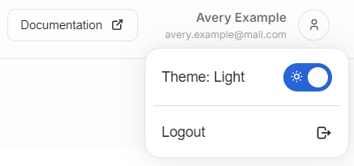

---
tags:
  - color theme
  - preferences
---
<!--
Copyright © Advanced Micro Devices, Inc., or its affiliates.

SPDX-License-Identifier: MIT
-->

# Personal Preferences

{{ name }} platform has several settings the users can adjust to change their user experience.

## Color theme

The platform supports light and dark color modes for different tastes.

Users can access the color theme toggler by clicking the username in the top right corner of the user interface. A single click in the area activates a dropdown menu containing the color theme switcher. User can change the color theme by clicking the toggle button indicated by a sun or moon icon.

