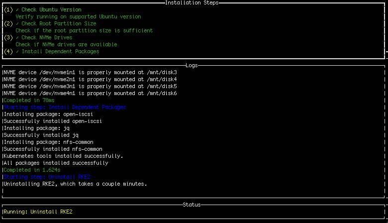
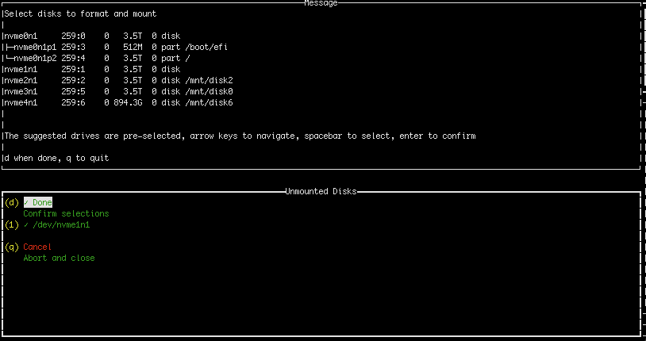

---
tags:
  - platform
  - installation
  - demo environment
  - kubernetes
---

# Install a SiloGen demo environment

This article explains how to install a Kubernetes cluster from metal to model in a streamlined manner.

The demo environment runs on top of a Kubernetes platform and includes essential Kubernetes components for monitoring, secrets management, and certificate management.

The installation process leverages helper tools called **Cluster Bloom** and **Cluster Forge** that deploy and configure all necessary platform components, preparing a Kubernetes cluster for executing AI workloads.

## Prerequisites

- Ubuntu (supported versions checked at runtime)
- Sufficient disk space (500GB+ recommended for root partition, 2TB+ for workloads)
- NVMe drives for optimal storage configuration
- ROCm-compatible AMD GPUs (for GPU nodes)
- Root/sudo access

## Set up the Kubernetes cluster

Please choose the appropriate installation scenario based on your infrastructure preferences.

### Set up a Kubernetes cluster (no existing Kubernetes cluster)

Use **Cluster Bloom** to install and configure a Kubernetes cluster. It installs the following features to prepare a (primarily AMD GPU) node to be part of a Kubernetes cluster:

- Automated RKE2 Kubernetes cluster deployment
- ROCm setup and configuration for AMD GPU nodes
- Disk management and Longhorn storage integration
- Multi-node cluster support with easy node joining
- 1Password integration for secrets management
- Cluster Forge integration

#### Installation steps
Download the latest Cluster Bloom release (adjust the URL to the release of your preference):

```
wget https://github.com/silogen/cluster-bloom/releases/latest/download/bloom
```

and run:

```
sudo ./bloom
```

The Cluster Bloom interface will appear:



For systems with unmounted physical disks, a selection prompt will appear:



After successful installation, Cluster Bloom generates `additional_node_command.txt`, which contains the command for installing additional nodes into the cluster.

### Install Kubernetes software into an existing Kubernetes cluster

To enable running AI workloads on the SiloGen platform in an existing Kubernetes cluster, download a Cluster Forge release package and run `deploy.sh`. This assumes there is a working Kubernetes cluster to deploy into, and the current Kubeconfig context refers to that cluster.

For the Cluster Forge `deploy` release:

```
wget https://github.com/silogen/cluster-forge/releases/download/deploy/deploy-release.tar.gz
tar -xzvf deploy-release.tar.gz
sudo bash clusterforge/deploy.sh
```

## Validating the installation

Verify successful installation by running TinyLlama workloads as described
[here](../ai-workloads-manifests/llm-inference-vllm/helm/README.md).
You can confirm that services are running in the cluster using K9s, a terminal-based UI for Kubernetes clusters, which is installed by Cluster Bloom.

## Appendix

- Cluster Forge: [https://github.com/silogen/cluster-forge](https://github.com/silogen/cluster-forge)
- Cluster Bloom: [https://github.com/silogen/cluster-bloom](https://github.com/silogen/cluster-bloom)
