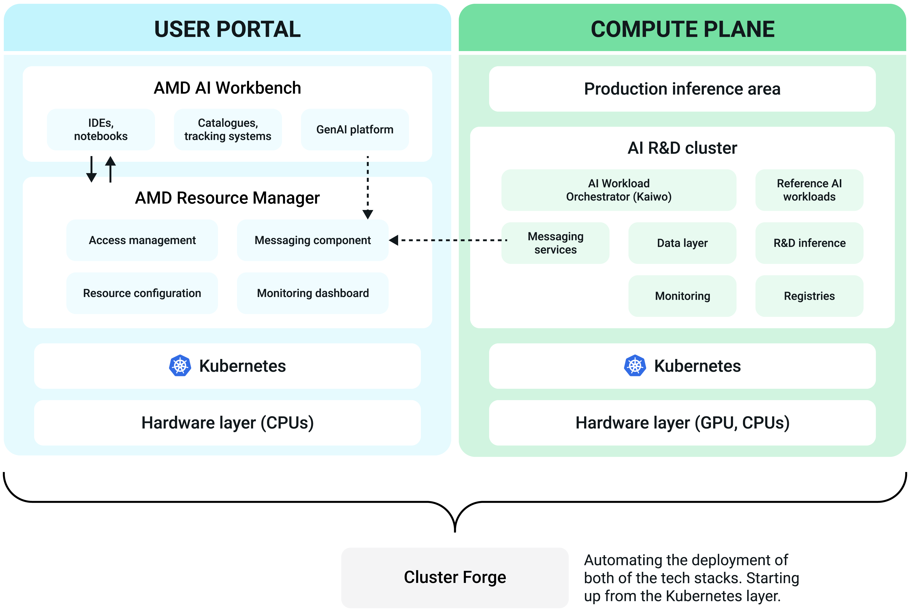

---
tags:
  - platform
  - introduction
  - features
---
<!--
Copyright © Advanced Micro Devices, Inc., or its affiliates.

SPDX-License-Identifier: MIT
-->

# Overview of AMD Resource Manager & AMD AI Workbench

AMD Resource Manager & AMD AI Workbench is a full-stack solution for developing, deploying, and running AI workloads on a Kubernetes platform optimized for AMD compute. The platform can be utilized by system administrators, resource managers, AI researchers, and AI solution developers.

## Key features of the platform

AMD Enterprise AI platform offers a variety of features for AI compute use.

**Optimized GPU utilization & lower operational costs** 
AMD Enterprise AI platform ensures high GPU efficiency through intelligent workload placement and dynamic resource sharing. This eliminates waste, reduces costs, and guarantees fair access to compute power—empowering teams to innovate without delay.

**Unified AI infrastructure** 
The platform consolidates fragmented environments into a cohesive AI ecosystem. With standardized governance, tools, and processes, the platform simplifies operations and enables seamless collaboration across teams and business units.

**Accelerated AI delivery** 
AMD Enterprise AI platform streamlines the setup of AI resources and automates dependency management. By enabling reuse of AI assets and prebuilt templates, teams can move faster from experimentation to production—shortening time-to-value.

**AI-native workload orchestration** 
Unlike traditional schedulers, the platform is optimized for AI. It intelligently prioritizes jobs, dynamically allocates resources, and ensures consistent performance, maximizing the utilization of compute infrastructure.

With AMD Enterprise AI platform enterprises reduce complexity, accelerate AI deployment, and maximize ROI—turning AI from a cost center into a strategic advantage.

## Key components of the platform

The AMD Enterprise AI platform is designed to provide a solid end-to-end model development, evaluation, and inference experience optimized for AMD DC GPUs.

**AMD AI Workbench** 
Enables researchers to manage AI workloads end-to-end. The AMD AI Workbench focuses on user experience, offering low-code approaches for developing AI applications by simplifying the execution of fine-tuning, inference, and other jobs.

Focusing on user experience, the AMD AI Workbench has a comprehensive model catalog, enabling AI researchers to better understand which models, data, and workloads they can use and download for their work. Finally, the AMD AI Workbench offers (and aims to expand) integrations with well-established MLOps tools such as MLflow, TensorBoard, and Kubeflow, allowing researchers to use the AI development tools that feel most natural to them.

**AMD Resource Manager** 
With AMD Resource Manager, enterprises can manage resource utilization on the R&D compute cluster by mapping user groups to compute, data, and image resources. Resource Manager maximizes GPU usage by allowing projects and user groups to share GPUs and by configuring compute clusters with policies that enable fair and smart scheduling. Administrators can monitor GPU utilization at the project, department, cluster, and enterprise levels using dashboards.

**Kaiwo (Kubernetes - AI Workload Orchestrator)** 
Kaiwo optimizes GPU resource utilization for AI workloads by minimizing GPU idleness. The workload scheduler increases resource efficiency through intelligent job queueing, fair sharing of resources, guaranteed quotas, and opportunistic gang scheduling. It controls the deployment of AI workloads by implementing a Kubernetes operator that watches for the deployment of AI workloads. Main functions:

- Decides where and when workloads will be executed based on compute policies.
- Supports multiple queues, fair GPU resource sharing, topology-aware scheduling, and other features. Open sourced at [https://github.com/silogen/kaiwo](https://github.com/silogen/kaiwo).

**Kubernetes platform** 
The core orchestration platform for managing containerized applications. Kubernetes is the industry standard for orchestrating containerized applications at scale. It provides the flexibility, scalability, and reliability needed to support enterprise AI workloads—from training machine learning models to serving predictions in production.

**Cluster Forge** 
A tool built to help enterprises easily deploy a scalable, production-ready AI platform using open-source technologies. Cluster Forge automates the deployment of the control and compute planes onto Kubernetes clusters, integrates prepackaged AI workloads, and enables organizations running on AMD hardware to start training and deploying models within just a few hours—essentially offering a streamlined, "one-click" setup for enterprise-grade AI infrastructure.

**AI workloads** 
Reference AI workloads optimized for AMD compute, including model fine-tuning, pretraining, evaluation, and inference workloads. These workloads have been tested and executed on AMD GPUs and are open sourced ([https://github.com/silogen/ai-workloads](https://github.com/silogen/ai-workloads)). The AI workloads provide building blocks for broader collaboration across the AI ecosystem and accelerate the development of AI use cases. The catalog of pre-developed AI workloads is continuously updated.
