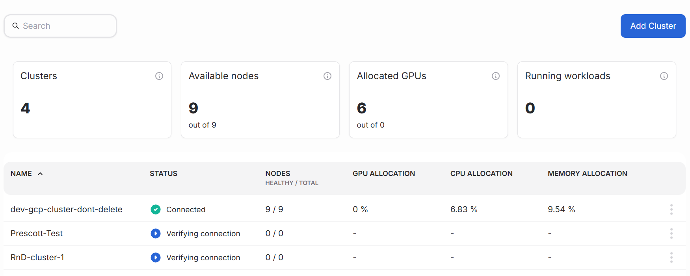
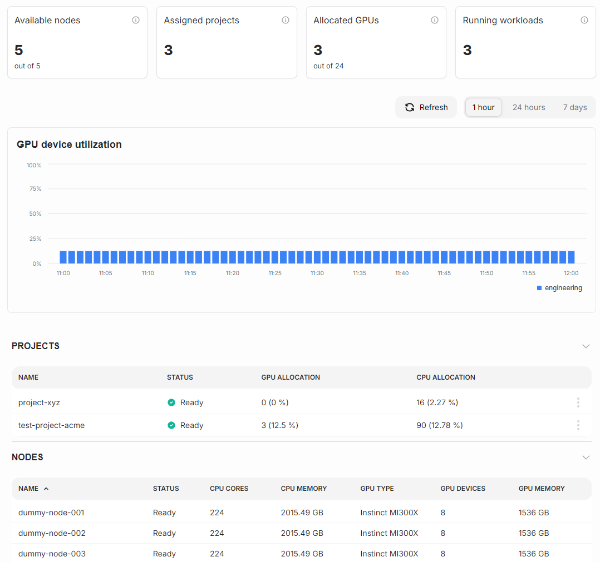

```{tags} AMD Resource Manager, cluster
```
<!--
Copyright © Advanced Micro Devices, Inc., or its affiliates.

SPDX-License-Identifier: MIT
-->

# Clusters Overview

The Clusters page provides a quick and easy way to see the status of all your clusters.

## What is a cluster?

A cluster is a set of nodes (interconnected computers) that work together to run containerized applications, including AI/ML models, data pipelines, and inference services.

A cluster is the physical part of the platform installation, which can be managed in the AMD Resource Manager user interface.

## Clusters overview page

The clusters overview provides a list of the clusters added to the platform, along with their status. You can see the following information about your clusters:

**Clusters**: Clusters for your organization that have been onboarded to AMD Resource Manager. Onboarding clusters allows you to manage resources, projects, and workloads on them.

**Available nodes**: The total number of nodes available across all clusters. AMD Resource Manager routinely pulls node information from clusters, including resources and health.

**Allocated GPUs**: The total number of GPUs allocated to project quotas across all clusters. Users belonging to projects with GPU quotas are guaranteed allocated GPU resources for their workloads in the corresponding clusters.

**Running workloads**: The total number of active workloads across all clusters. Workloads submitted via AMD Resource Manager are optimally scheduled, tracked, and monitored for resource usage and health.

**Clusters table**

| Column            | Description                                                                                                                                                                               |
| ----------------- | ----------------------------------------------------------------------------------------------------------------------------------------------------------------------------------------- |
| Name              | The name of the cluster                                                                                                                                                                   |
| Status            | Status of the cluster                                                                                                                                                                     |
| Nodes             | The number of nodes associated with this cluster. Shows the number of healthy nodes and total nodes.                                                                                      |
| GPU allocation    | The share of the total number of GPUs allocated to quotas in the cluster. Users belonging to projects with GPU quotas are guaranteed allocated GPU resources for their workloads.         |
| CPU allocation    | The share of the total number of CPUs allocated to quotas in the cluster. Users belonging to projects with CPU quotas are guaranteed allocated CPU resources for their workloads.         |
| Memory allocation | The share of the total amount of memory allocated to quotas in the cluster. Users belonging to projects with memory quotas are guaranteed allocated memory resources for their workloads. |



## Single cluster status

The Cluster page provides a quick and easy way to see the status of your cluster.

**Available nodes**: The total number of nodes available in the cluster. AMD Resource Manager routinely pulls node information from the cluster, including resources and health.

**Assigned quotas**: Quotas assigned to the cluster resources. Each project has a quota to limit the amount of resources they are guaranteed on the cluster.

**Allocated GPUs**: The total number of GPUs allocated to quotas in the cluster. Users belonging to projects with GPU quotas are guaranteed allocated GPU resources for their workloads.

**Running workloads**: The total number of active workloads running on the cluster. Workloads submitted via AMD Resource Manager are optimally scheduled, tracked, and monitored for resource usage and health.

**Projects table**

| Column         | Description                                    |
| -------------- | ---------------------------------------------- |
| Name           | Unique identifier for the projects             |
| Status         | Status of the project                          |
| GPU allocation | Total number of GPUs allocated to this project |
| CPU allocation | Total number of GPUs allocated to this project |

**Nodes table**

| Column      | Description                                   |
| ----------- | --------------------------------------------- |
| Name        | Name of the node                              |
| Status      | Status of the node                            |
| CPU cores   | Number of CPU cores available on the node     |
| CPU memory  | Amount of memory available on the node        |
| GPU type    | Type of GPU                                   |
| GPU devices | Number of GPUs on the node                    |
| GPU memory  | Amount of GPU memory available on the node    |


