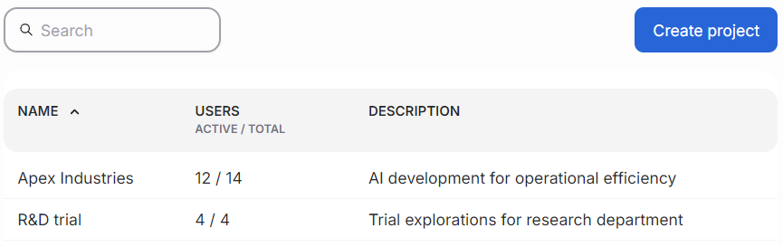

```{tags} projects, AMD Resource Manager
```
<!--
Copyright © Advanced Micro Devices, Inc., or its affiliates.

SPDX-License-Identifier: MIT
-->
# Manage Projects

Projects help you organize and manage your work in the platform. Each project is isolated from others, meaning resources, workloads, and secrets in one project are not accessible from another. This ensures security and clear boundaries for your work.

## Project quotas

Each project has a compute quota, which defines the guaranteed amount (such as CPUs, memory, and GPUs) that can be used by workloads in that project - resources on the cluster can be borrowed by a project as long as they are idling. This promotes fair distribution by guaranteeing each project a minimum share, while still allowing projects to temporarily use idle resources when available.

## User access

Only platform administrators can create new projects and assign users to them. Regular users can only access and run workloads in projects they are assigned to. Users can initiate workloads only in the projects they are assigned to.

## Project secrets

Projects can securely store and access secrets (such as API keys or credentials) required by their workloads. Secrets are managed at the organizational level and can be assigned to, or shared across, projects as needed.

## Creating and managing projects

Project names must be unique and follow naming rules: use only lowercase letters, numbers, and dashes (no spaces or special characters).

The main projects view lists available projects, the number of assigned users, and a short description of each project. To add a new project, click the "Create project" button.



Clicking a project's name opens the edit view. Here, you can edit project details. Note that the project's name is permanent and cannot be changed. Click the "Save changes" button to apply updates.

Below the form is an area called the "Danger zone." It contains a button for deleting the project. **Deleting a project will permanently remove all associated workloads, data, and secrets. This action cannot be undone, so use caution.**

The right pane lists users assigned to the project and provides an option to add new project members. Administrators can also invite new users directly to the
