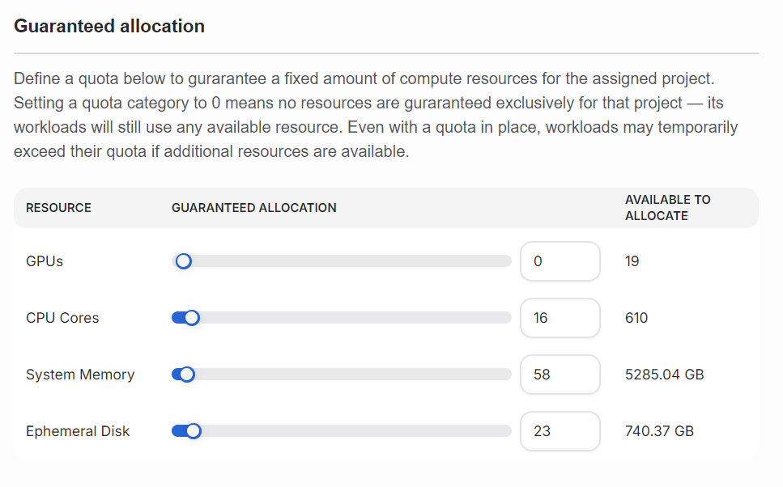

<!--
Copyright © Advanced Micro Devices, Inc., or its affiliates.

SPDX-License-Identifier: MIT
-->

```{tags} AMD Resource Manager, quota, project
```

# Project Quotas Overview

A quota is a usage limit set on a project. Teams use project quotas to accomplish their tasks by ensuring everyone gets their fair share of compute resources. Without quotas, some workloads might use all the resources, leaving other workloads waiting.

Quotas define a _minimum_ set of resources that are guaranteed. There is no maximum, so quotas can be exceeded if unused resources are available.

In AMD Resource Manager, you can manage GPU, CPU, memory, and disk quotas for your projects. When a new project is created, the quota for all resources is zero. Only after the project is created can the quotas be updated.

```{note}
In systems with only one project, the quota settings aren't really needed. Only after having a second project does quota management become important.
```

## Quota status

In AMD Resource Manager, a project is a way to separate whatever tasks a team is working on. The status of the project is the status of those tasks.

For the most part, AMD Resource Manager works with AI-focused tasks, which are primarily resource-heavy workloads. In order for the workload to run, the cluster needs to be made aware of the quota requested by the project.

Currently, the project status reflects the state of this application of the quota to the cluster.


## Manage quotas

This article explains how to define quotas for your projects. In AMD Resource Manager, you can set quotas for GPUs and CPUs for your projects. Users belonging to a project are guaranteed the allocated quota for their AI workloads.

## Guaranteed quota panel

Project quota can be adjusted using the sliders or by inputting the required allocations into the fields.



**GPU allocation**: Number of GPUs allocated for this project. Users belonging to this project are guaranteed the allocated GPU quota for their workloads.

**CPU allocation**: Number of CPUs allocated for this project. Users belonging to this project are guaranteed the allocated CPU quota for their workloads.

**System memory**: Memory allocation for this project. Users belonging to this project are guaranteed the allocated memory for their workloads.

**Ephemeral disk allocation**: Disk storage allocation for this project. Users belonging to this project are guaranteed the allocated storage for their workloads.
