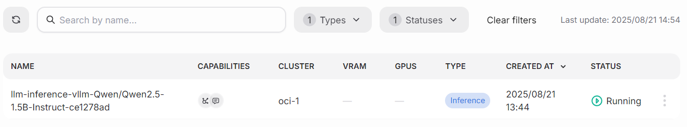
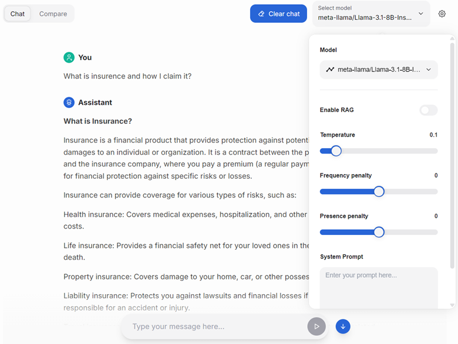

<!--
Copyright © Advanced Micro Devices, Inc., or its affiliates.

SPDX-License-Identifier: MIT
-->

```{tags} AMD AI Workbench, fine-tuning, tutorial
```

# Fine-tune a Model with Low Code

This guide teaches you how to fine-tune a model through AMD AI Workbench user interface without writing any code. Follow these steps to complete a fine-tuning job:

1. Select a base model and a dataset for fine-tuning.
2. Start the model fine-tuning workload and monitor its status.
3. Deploy the fine-tuned model for inference.
4. Chat with the fine-tuned model using the chat interface.

## 1. Select a base model and a dataset for fine-tuning

Go to the `Models` page and select the `Custom models` tab. Make sure you have a model available for fine-tuning; you can check model capabilities in the "Capabilities" column. If there are no fine-tunable models, download one from the `Models` page.

Create a fine-tuned model by clicking the "Fine-Tune Model" button and choosing the appropriate options:

- In the `Base Model` field, select a preloaded model.
- In the `Training data` field, select a preloaded dataset.
- In the `Name` field, enter a unique name for your fine-tuned model.
- In the `Description` field, provide a description for your fine-tuned model.
- You can skip the `Advanced parameter` fields and use the default values.
- Finally, click `Start training` to start fine-tuning the model.


## 2. Observe the model fine-tuning workload

Go to the `Workloads` page to view details of your running AI workloads. In the table, you can see the workload name, the assigned cluster, and the resources required. The `Status` column displays the last known status of each workload and is not updated automatically. You can use filters to find workloads by name, type, or status.



Find more details about workloads [here](../core/docs/workbench/workloads.md).

## 3. Deploy the model for inference

Click the `Deploy` button next to the model you want to make available for inference. Please note that once deployed, a model may take up to 5 minutes before it can begin serving requests.


Once deployed, navigate to the `Chat and Compare` page to interact with the model.

After verifying your model's performance, you can click the "View Code" menu item on the `Models` page and use the provided code snippet for inference via the API.

## 4. Chat with the model

On the `Chat` page, select your fine-tuned model from the drop-down list in the top-right corner.

Type a question in the chat to interact with the model.



### Inspecting the debug output

After receiving a response from the model, you can inspect the messages sent to the model, the context retrieved as part of RAG, and the tokens used by clicking the "bug" icon next to the response.


