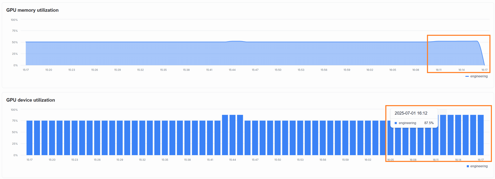
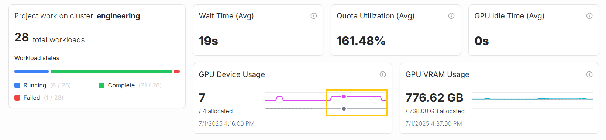

---
tags:
  - airman
  - resource management
  - tutorial
---

# Resource utilization of AI workloads

This guide teaches you how you can observe and manage the amount of resources that your AI workloads are using. Follow these steps to complete find about resource utilization:

1. Start a new AI workload to consume resources.
2. Observe the amount of resources your AI workload is using by viewing the dashboards in SiloGen AI Resource Manager.
3. Adjust resource quotas as needed.

## 1. Consume resources by running AI workloads

To consume resources, start a new AI workload that uses GPUs. For example, you can run a model fine-tuning workload by following the instructions in ["Model fine-tuning"](../../core/docs/developer-center/training/fine-tuning/). Once the workload has started, navigate to the `Projects` page, select your project, and observe the number of GPUs and the amount of VRAM the workload is using.

See the example below:

## 2. Observe the change in resource utilization

Go to the `Dashboard` and select the "1 hour" time period to observe changes in resource consumption. You will see that resource utilization has increased due to the model fine-tuning workload.

You can view more details about resource utilization on the `Project dashboard`.

## 3. Adjust the quota

If your AI workloads are pending and unable to start, you may need to allocate more resources for them. This can be done by increasing the project quota in the project settings to make more resources available.