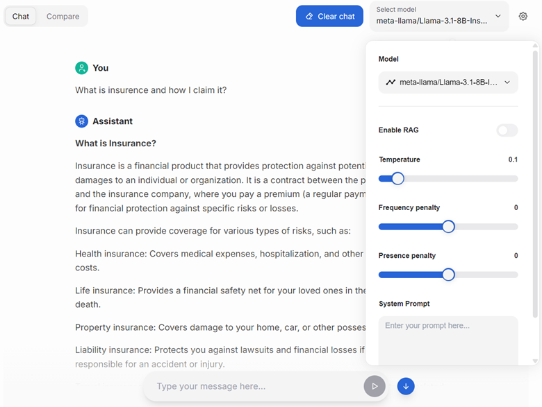
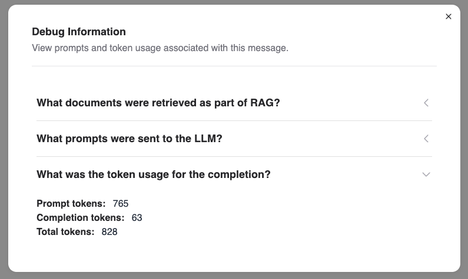

<!--
Copyright © Advanced Micro Devices, Inc., or its affiliates.

SPDX-License-Identifier: MIT
-->

```{tags} AMD AI Workbench, chat
```

# Chat

The chat page allows you to experiment with models you have access to. You can modify several parameters to see how they affect the model's response.

## Accessing the chat

Navigate to `Chat and Compare` page to access the chat.

You will be able to choose from the list of models you have access to.

Expand the settings toggle to view and modify the generation parameters.



## Inspecting the debug output of the model

Once you have a response from the model, you can inspect the messages sent to the model, the context retrieved as part of generation, and the consumed tokens by clicking the "bug" icon next to the response.



