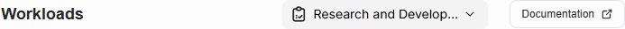
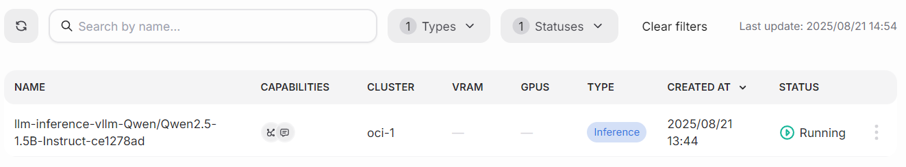
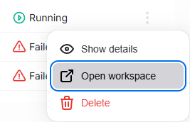

<!--
Copyright © Advanced Micro Devices, Inc., or its affiliates.

SPDX-License-Identifier: MIT
-->

```{tags} AMD AI Workbench, workloads, workspaces
```

# Workloads

A workload is a batch job or a service running in the cluster with resources defined by the workload and limited by the quota that the workload owner has. This page shows all started workloads. The view shows all workload statuses by default except `Deleted`.

If a user belongs to multiple projects, the project needs to be selected first from the top of the page.



The paginated table shows the name of the workload, the cluster the workload is assigned to, and how many resources the workload requires. The `Status` column shows the last known status of the workload and is not updated automatically. Filters can be used to find workloads by name, type, or status.



## Actions

Workload actions are available from the Actions column by pressing the three-dot button.



### Show details

Shows details of the workload, such as when it was created and by whom.

### Delete

Queues the workload for deletion.

### Open workspace

If the workload type is `Workspace`, selecting this action opens the workspace in a new browser tab.

## Workload types

| Type               | Description                                                                            |
| ------------------ | -------------------------------------------------------------------------------------- |
| **Model Download** | Batch job for downloading a new AI model                                               |
| **Inference**      | Inference service                                                                      |
| **Fine-Tuning**    | Model fine-tuning batch job which generates a new model                                |
| **Workspace**      | Workspace for model experiments                                                        |
| **Custom**         | A workload not submitted via AMD AI Workbench, but for example, via API or via kubectl |

## Workload statuses

| Status            | Description                                             | Condition                                                |
| ----------------- | ------------------------------------------------------- | -------------------------------------------------------- |
| **Added**         | Workload has been created                               | Workload component creation has not started              |
| **Pending**       | Waiting to start                                        | All components are in the `Pending` state                |
| **Running**       | Workload is being executed                              | Any component is in the `Running` state                  |
| **Complete**      | Workload has finished successfully                      | All components are in the `Completed` state              |
| **Failed**        | An error has occurred and the workload did not complete | Any component is in the `Failed` state                   |
| **Deleting**      | Workload is queued for removal                          | Delete started, but not all components are `Deleted`     |
| **Deleted**       | Workload successfully deleted                           | All components are in the `Deleted` state                |
| **Delete Failed** | Delete failed and manual cleanup might be needed        | Any component is in the `Delete Failed` state            |
| **Terminated**    | Execution has been terminated                           | All components are in the `Completed` or `Deleted` state |
| **Unknown**       | Status cannot be determined                             |                                                          |

## Workload logs

Workload logs provide near real-time visibility into the execution and status of running workloads. The logging functionality allows users to monitor workload progress, troubleshoot issues, and analyze performance.

### Accessing logs

Logs can be accessed through the workload details view:

1. Navigate to the **Workloads** page
2. Open the action menu (`⁝` icon) on a workload row and use the **Open details** action
3. Click the **Logs** button in the workload details page
4. Alternatively you can also access the logs directly from the workload action menu by selecting **View logs**

### Log features

- Log sources: Currently we support **stdout/stderr** collection from the running workloads
- **Real-time streaming**: Logs are streamed in near real-time for active workloads and stored for later analysis for completed workloads
- **Log levels**: View logs by severity level (Info, Warning, Error, Debug)
- **Timestamps**: All log entries include precise timestamps for chronological tracking

**Note:** Kubernetes Events collection is not yet supported

### Log retention

- Logs are retained until disk space is needed; there is **no fixed retention period**
- When disk usage is high, older logs are rotated and deleted to free up space
- Typical retention is currently **1–2 weeks**, but this may vary depending on workload volume and disk usage
- **Active workloads**: Logs are available immediately upon workload start
- **Completed workloads**: Historical logs remain accessible until rotated out
- **Failed workloads**: Runtime error logs are preserved like other logs, subject to rotation policy

### Log types by workload

| Workload Type      | Available Logs                                            |
| ------------------ | --------------------------------------------------------- |
| **Model Download** | Download progress, validation, storage operations         |
| **Inference**      | Request/response logs, model loading, performance metrics |
| **Fine-Tuning**    | Training progress, loss metrics, checkpoint saves         |
| **Workspace**      | Jupyter/VS Code server logs, user session activity         |
| **Custom**         | Application-specific logs based on workload definition    |
