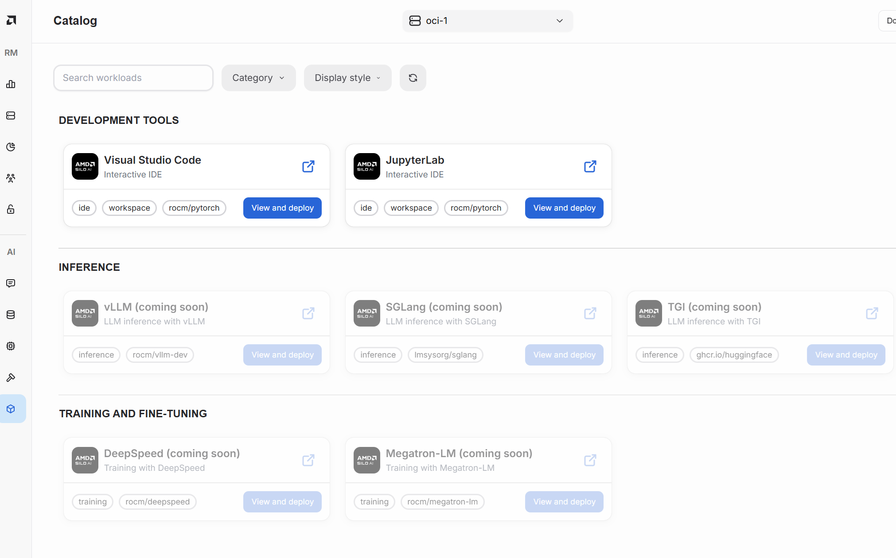
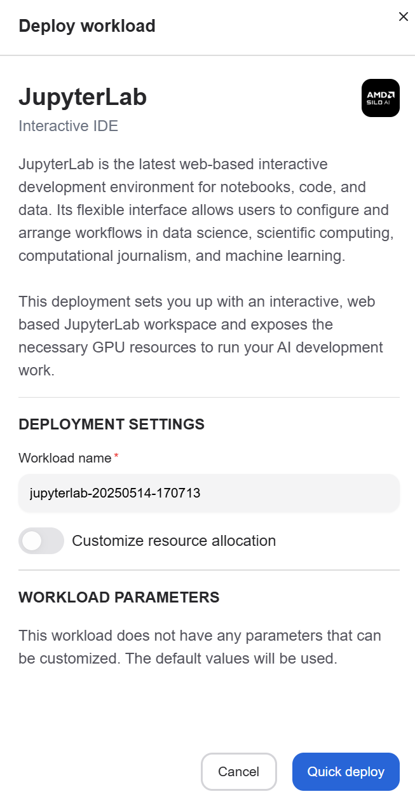

---
tags:
  - developer center
  - ai catalogue
  - workload
---

# AI workloads catalogue

The AI Catalogue contains reference AI workloads optimized for AMD compute. This includes model fine-tuning, pretraining, evaluation and inference workloads. The AI workloads have been tested and executed on top of AMD GPUs and they have been open sourced ([https://github.com/silogen/ai-workloads](https://github.com/silogen/ai-workloads)).

## Select a workload

You can select a workload from the catalogue by selecting "View and Deploy".

## Deploy a workload

You can deploy a workload by clicking "Quick deploy".

