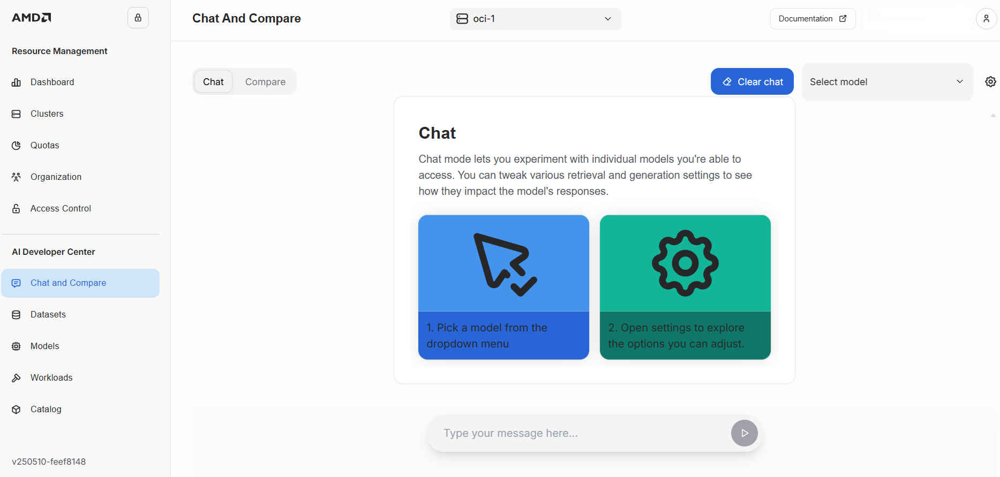

---
tags:
  - developer center
  - workload
  - fine-tuning
---

# Overview

SiloGen Developer Center provides an easy-to-use no-code/low-code option for running and managing AI workloads.

## AI workload catalogue

SiloGen provides a comprehensive set of AI workloads including developer tools, model fine-tuning and inference.

## Model fine-tuning

You can select a suitable base model and fine-tune the model for your use case.

1. Select "Fine-Tune Model"
2. Specify model fine-tuning parameters

3. Select "Start training".

You can see the status of the model fine-tuning as "Pending". When fine-tuning has completed status will turn to "Ready."

## Model deployment

!!! note
    A placeholder for model deployment content.