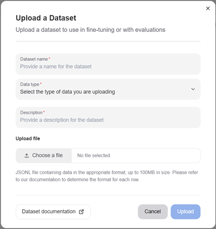
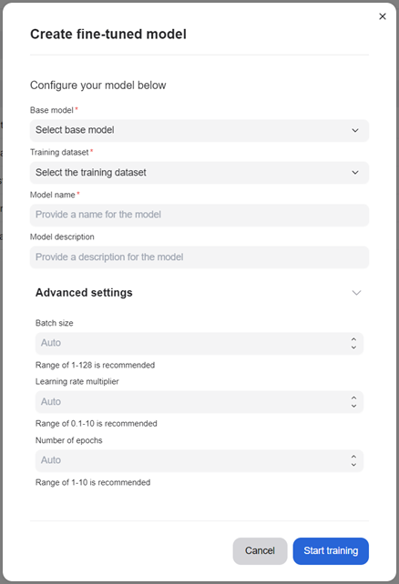

---
tags:
  - developer center
  - fine-tuning
---

# Fine-tuning

Fine-tuning a model allows you to customize it to your specific use case with your data. We provide a certified list of base models which you can fine-tune and we allow you to customize certain hyperparameters to get the best results.

Fine-tuned models can be deployed and subsequently be used for evaluation and inferencing once weights for the model have been computed.

## Getting ready to fine-tune your model

### Uploading training data

One of the first steps to take towards fine-tuning your model is to upload training data to the platform. The training data should represent a wide range of indicative conversations that you would like your model to respond to as part of inference.

Once you have procured training data for your model, navigate to the "Datasets" page of the developer console to upload the dataset. We currently support uploading datasets in a JSONL format, where each row represents a separate chat conversation.

Subsequently, click the "Upload" button and drop your JSONL file in with a name and description

## Creating a fine-tuned model

Now navigate to Models page. You can trigger the creation of your fine-tuned model by clicking the "Fine-Tune Model" button and selecting appropriate entries.

You must provide your model a name and can optionally specify a description and any of the three hyperparameters: batch-size, learning-rate multiplier and number of epochs. If you are unsure of the values to use, leave the fields empty, to auto-select the default certified values.

Once the fine-tuning process has successfully been triggered, you will be able to see your model in the "Not-deployed" tab of the page and the fine-tuning run itself in the "Run status" section.

The fine-tuning run may take several hours to complete, so we recommend visiting the Developer console occasionally when the run is in progress. If the run fails mid-way, please reach out to our customer success team, and we will help triage your issue.

## Deploying a fine-tuned model

Once your model has been successfully trained, the model status will reflect as "Ready": this means that the weights have been successfully computed for your model and it can be used for inferencing.

Click the "Deploy button" corresponding the model you would like to deploy, and have it usable for inferencing. Please note that a model once deployed can take upto 5 minutes before it can serve requests.

Once deployed, you can navigate either to the "Chat and Compare" page to converse with the model.

## Examples

[Run model fine-tuning workload through Kubernetes CLI](../ai-workloads/workloads/llm-finetune-silogen-engine/helm/README.md)

[Scalable fine-tuning](../ai-workloads/docs/tutorials/tutorial-01-deliver-resources-and-finetune.md)