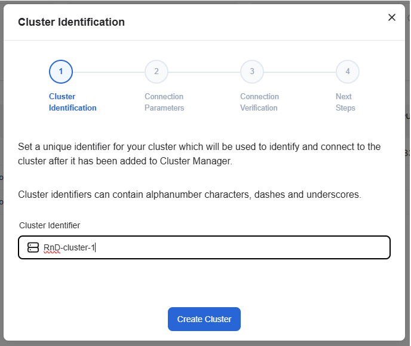

---
tags:
  - airman
  - cluster
  - add cluster
---

# Create a new cluster in the UI

This article explains how to create a new cluster in Airman user interface.

To add a new cluster:

1. Click the "Add Cluster" button.

2. Cluster identification - Set a unique identifier for your cluster.

3. Set connection parameters and click "Verify Connection" button.

4. Verify connection - wait for connection verification to complete.

5. Complete next steps phase in the process.

## Delete a cluster

1. Select the cluster you want to delete.

2. Click "Delete" on the right menu of the cluster you want to delete.