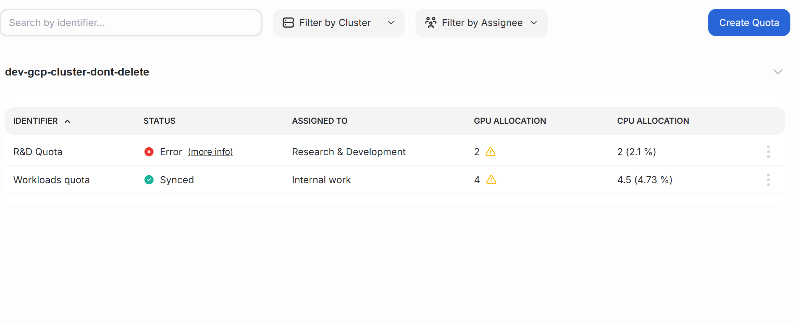

# Quotas overview

The Quotas page provides a quick and easy way to see the status of all your clusters. 
## What is a quota?

Quota is a usage limit reserved for a team to accomplish their tasks. Quotas are useful for ensuring everyone gets their fair share of compute resourses.
In Airman you can manage GPU and CPUs quotas for your user groups.

**Quotas table**

| Column      | Description |
| ----------- | ----------- |
| Identifier      | The name of the quota       |
| Status   |  Status of the quota |
| Assigned to          |   The user group that this quota applies to.          |
| GPU allocation   | Number of GPUs allocated for this user group. Users belonging to this user group are guaranteed the allocated GPU quota for their workloads     |
| CPU allocation   | Number of CPUs allocated for this user group. Users belonging to this user group are guaranteed the allocated CPU quota for their workloads.        |

