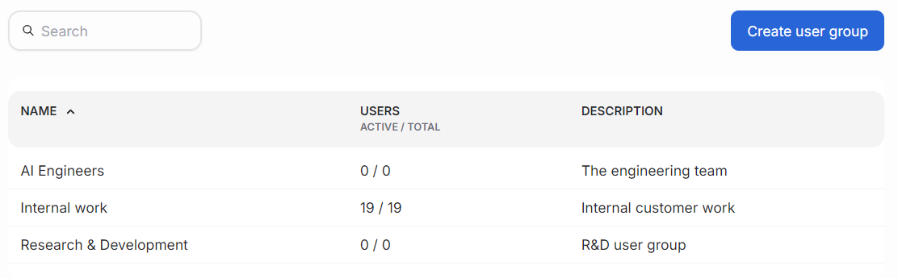
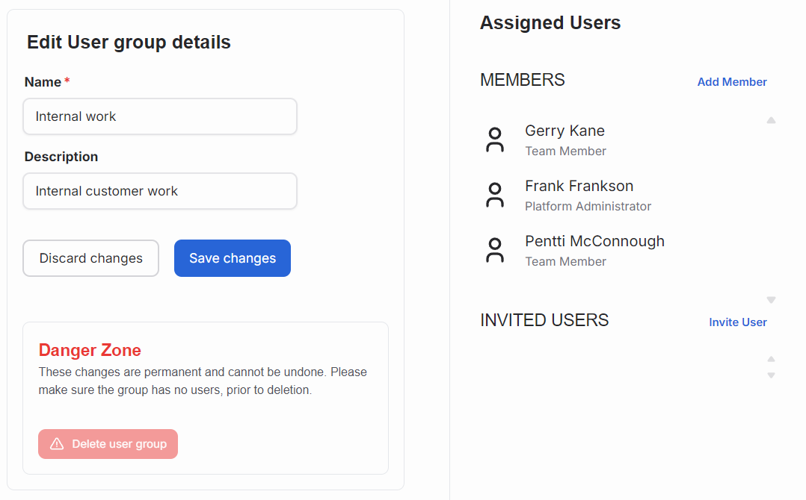

---
tags:
  - user management
  - user groups
---

# Manage user groups

A user group is a collection of users bundled together to do AI work.

The main view of user group management lists available user groups, the amount of assigned users and a short description about the groups.

Clicking the user group's name opens the edit view, that is similar to the new user group creation page. Adding new user groups happens by clicking the "Create user group" button. The view has a form for editing user group details. Click "Save changes" button to accept the update.

Below the form is an area called Danger zone. It contains a button for deleting the user group. Deleting a group is a permanent action, and shouldn't be done without proper consideration.

The right pane lists users assigned to the user group and option to add or invite new users.

Only platform administrators can create new user groups and assign users to them.
