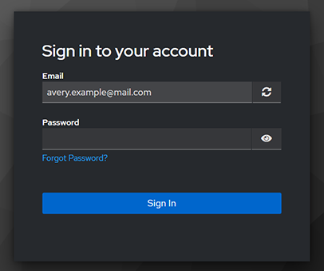

---
tags:
  - login
  - keycloak
---

# Login to SiloGen platform

Users log in to SiloGen platform in their dedicated URL address, for example `your-silogen.ai`. Writing the address into browser's address bar takes you to the login page. The page has a button called "Sign in with Keycloak", that takes you to the authentication service.

Input your email address to the specified field and click "Sign In" button to continue with the login. Inputting wrong credentials will end up with an error screen.

The next screen requires users to input their password. There is also a link to request a new password in case of loosing the previous one. Users can also restart the login process by clicking the refresh icon. Clicking the "Sign In" button will take the user to application or end up with an error message in case of a wrong password.

## Keycloak user authentication

SiloGen platform uses [Keycloak](https://www.keycloak.org/) for authenticating users. Keycloak is tightly integrated with all of the SiloGen services, and setting it up is straightforward. It can be federated so that users' credentials can be centrally managed in an enterprise solution, and integrated with LDAP or Active Directory.

## Other login measures

SiloGen platform can be modified to utilize other login measures, such as working in an internal network through VPN.