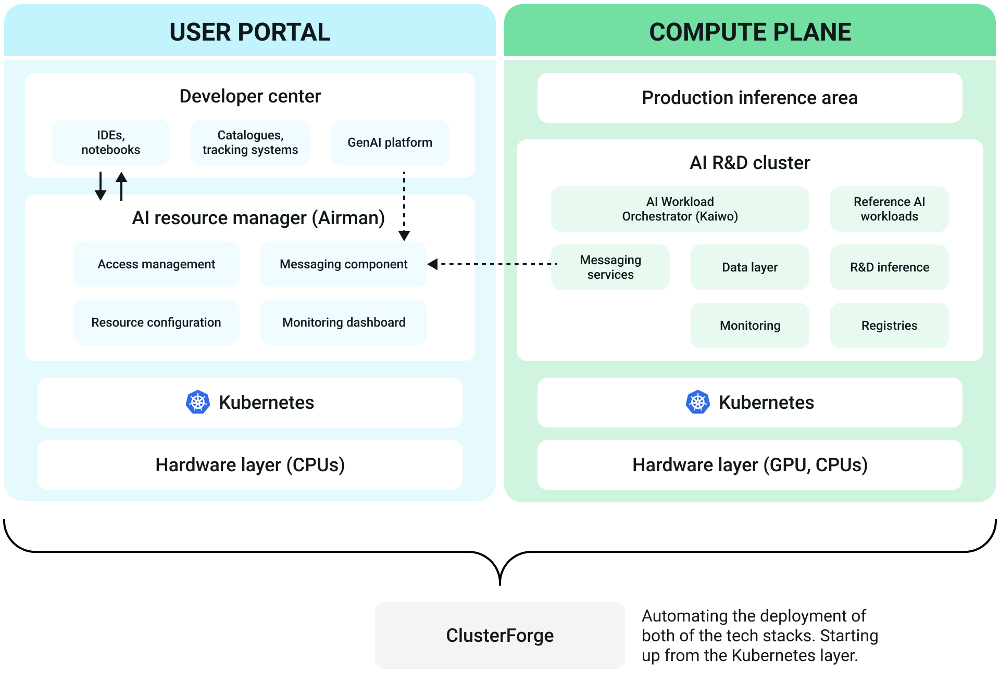

---
tags:
  - platform
  - introduction
  - components
---

# Overview of the SiloGen Enterprise AI Platform
SiloGen Enterprise AI Platform offers a full-stack AI platform for developing, deploying and running AI workloads on a Kubernetes platform optimized for AMD compute. The platform can utilized by system administrators to resource managers and AI researchers to AI solution developers.

## Key features of SiloGen platform
Silogen platform offers a variety of useful features for utilising AI compute.

**Optimized GPU utilization & lower operational costs** 
SiloGen ensures high GPU efficiency through intelligent workload placement and dynamic resource sharing. This eliminates waste, reduces costs, and guarantees fair access to compute power — empowering teams to innovate without delay.

**Unified AI infrastructure** 
Our platform consolidates fragmented environments into a cohesive AI ecosystem. With standardized governance, tools, and processes, SiloGen simplifies operations and enables seamless collaboration across teams and business units.

**Accelerated AI delivery** 
SiloGen streamlines the setup of AI resources and automates dependency management. By enabling reuse of AI assets and prebuilt templates, teams can move faster from experimentation to production — shortening time-to-value.

**AI-native workload orchestration** 
Unlike traditional schedulers, SiloGen is optimized for AI. It intelligently prioritizes jobs, dynamically allocates resources, and ensures consistent performance, maximizing the utilization of compute infrastructure.

With SiloGen, enterprises reduce complexity, accelerate AI deployment, and maximize ROI—turning AI from a cost center into a strategic advantage.

## Key components of SiloGen platform

The SiloGen platform is designed to provide a solid end-to-end model development, evaluation and inference experience optimized for AMD DC GPUs.

**Developer Center (Dev Center)** 
Enables researchers to manage AI workloads end-to-end. The Developer Center enables the usage of the SiloGen AI workloads and focuses on the user experience, offering low code approaches for developing AI applications by simplifying the execution of fine-tuning, inference and other jobs.

Focusing on the user experience the Developer Center also exposes a number of catalogues enabling AI researchers to have a better understanding on which models, data and workloads can use and download for the purposes of their work. Finally, the Develop Center offers (and aims to expand the) integrations to well established MLOps tools such as MLFlow, Tensorboards and Kubeflow allowing researchers to use the AI developing tool that feels more natural to them.

**AI Resouce Manager (Airman)** 
Using Airman enterprises can manage the resource utilization on the R&D compute cluster by mapping user groups to compute, data (and image) resources. With Airman, enterprises can maximize the usage of GPUs by allowing projects and user groups to share GPUs and by configuring the compute clusters with policies that enable fair and smart scheduling. Administrators can monitor the GPU utilization at a project, department, cluster and Enterprise level using Airman dashboards.

**Kaiwo (Kubernetes - AI Workload Orchestrator)** 
Kaiwo optimizes GPU resource utilization for AI workloads by minimizing GPU idleness. Workload Scheduler increases resource efficiency through intelligent job queueing, fair sharing of resources, guaranteed quotas and opportunistic gang scheduling. It controls the deployment of AI workloads by implementing a Kubernetes operator that watches for the deployment of AI workloads. Main functions:
- Decides where and when workloads will be executed based on compute policies.
- Supports multiple queues, fair GPU resource sharing, and topology-aware scheduling and other features. Open sourced at [https://github.com/silogen/kaiwo](https://github.com/silogen/kaiwo).

**Kubernetes platform** 
The core orchestration platform for managing containerized applications. Kubernetes is the industry standard for orchestrating containerized applications at scale. Kubernetes provides the flexibility, scalability, and reliability needed to support enterprise AI workloads, from training machine learning models to serving predictions in production.

**Cloud Forge** 
A tool built to help enterprises easily deploy a scalable, production-ready AI platform using open-source technologies. Cloud Forge automates the deployment of the control and compute planes onto Kubernetes clusters, integrates the prepackaged SiloGen AI Workloads, and enables organizations running on AMD hardware to start training and deploying models within just a few hours—essentially offering a streamlined, "one-click" setup for enterprise-grade AI infrastructure.

**AI Workloads** 
Reference AI workloads optimized for AMD compute. This includes model fine-tuning, pretraining, evaluation and inference workloads. The AI workloads have been tested and executed on top of AMD GPUs and they have been open sourced ([https://github.com/silogen/ai-workloads](https://github.com/silogen/ai-workloads)). SiloGen AI workloads provide building blocks for broader collaboration across the AI ecosystem and accelerate the development of AI use cases. The catalogue of pre developed AI workloads is continuously updated.