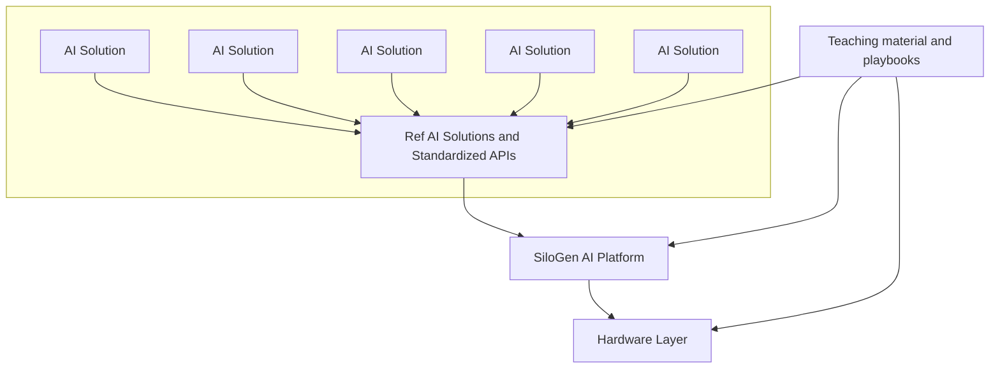
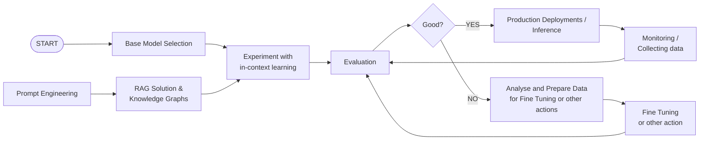
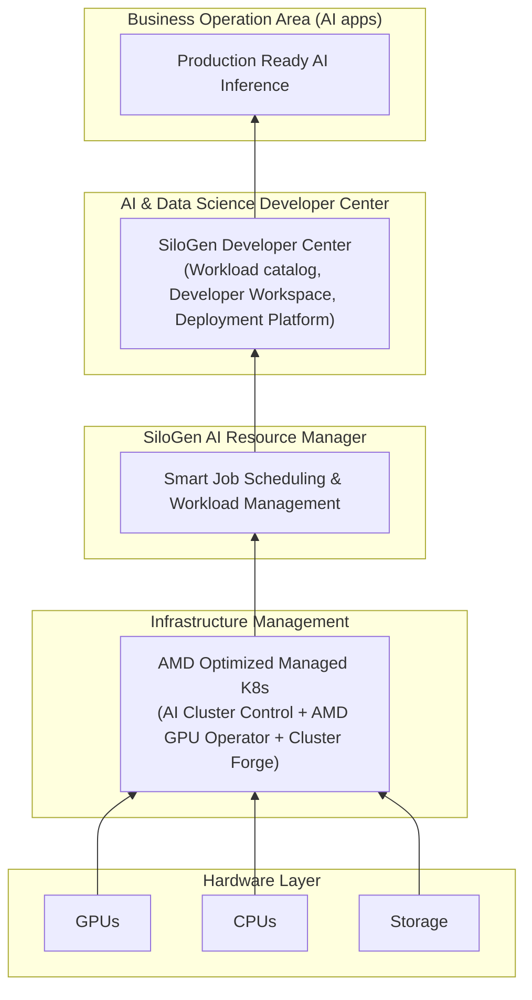

# Reference Architecture document - Enterprise AI platform   

## Executive summary

Enterprises striving to scale AI often encounter roadblocks that increase costs, slow innovation, and limit impact. The AMD SiloGen AI stack is purpose-built to overcome these challenges and unlock the full potential of AI across the enterprise.

**Optimized GPU utilization & lower operational costs** 
SiloGen ensures high GPU efficiency through intelligent workload placement and dynamic resource sharing. This eliminates waste, reduces costs, and guarantees fair access to compute power—empowering teams to innovate without delay.

**Unified AI infrastructure** 
Our platform consolidates fragmented environments into a cohesive AI ecosystem. With standardized governance, tools, and processes, SiloGen simplifies operations and enables seamless collaboration across teams and business units.

**Accelerated AI delivery** 
SiloGen streamlines the setup of AI resources and automates dependency management. By enabling reuse of AI assets and prebuilt templates, teams can move faster from experimentation to production—shortening time-to-value.

**AI-Native workload orchestration** 
Unlike traditional schedulers, SiloGen is optimized for AI. It intelligently prioritizes jobs, dynamically allocates resources, and ensures consistent performance, maximizing the utilization of compute infrastructure.

With SiloGen, enterprises reduce complexity, accelerate AI deployment, and maximize ROI—turning AI from a cost center into a strategic advantage.

---

## Introduction

The SiloGen Enterprise AI platform is designed to accelerate the development and integration of AI services into business operations. SiloGen AI platform enables Enterprises to become AI ready starting from “bare-metal” till offering state of the art technologies and reference solutions for the adoption of AI to business operations. Positioned between AI practitioners and the underlying hardware, the Enterprise AI platform provides interfaces and APIs, comprehensive tutorials, and reference solutions that accelerate AI adoption and bring efficiency in infrastructure management across multiple user groups and organizations. This abstraction eliminates the complexities associated with provisioning hardware, developing and maintaining software, and sharing compute resources, enabling users to focus on delivering AI solutions rather than managing infrastructure and re-inventing best practices.

## Requirements for accelerating AI utilization

The enterprise AI platform is designed to support the full lifecycle of AI solutions, from the provisioning of the right HW and software stack to the development and continuous operations of AI applications. To identify key usage scenarios and requirements, interviews were conducted with AI practitioners from large-scale enterprises). These discussions highlighted that GenAI use cases pose the greatest challenges. Gen AI use cases are ranging from chatbot support and productivity-enhancing AI solutions to drug discovery workflows, video generation, and agentic systems and those use cases introduce a new set of requirements to the traditional AI / ML platforms. Across these use cases, at least four core user personas and their workflows emerge. Standardizing and automating these workflows create a need for shared components and reusable software assets across different AI applications. These components and their requirements form the foundation of our reference architecture.

## User personas on the enterprise AI platform and their requirements

### The AI use case developer

This user group focuses on building AI products. To achieve this, they select the most suitable foundation model, evaluate its performance, validate its fit to their use cases, and enhance it using techniques like in-context learning or fine-tuning. For that reason, AI experts need the ability to onboard and use relevant datasets and models. For performing those operations AI use case developer need also to access scalable compute. Working with Large Language models requires a number of GPUs and the AI use case developers should be in position to access the needed GPU resources. Finally, AI use case developers are in need for monitoring and observability of their solution and of the resources they use. Developers must track system performance, assess and keep track of model predictions, and gather feedback to ensure the AI delivers the expected business value.

The following diagram summarizes the workflow of a GenAI -AI  developer. 

The figure shows several steps that can be standardized for the GenAI use case developers. For example, the steps of fine-tuning, model evaluation, monitoring and deployment can be standardized and automated. Additionally, the workflows for data and model onboarding that are not visible in the figure can be standardized too. These standardized steps are packaged as software AI assets in our reference architecture and offered as a service to the AI use case developers through our AI Developer Center and through SiloGen’s public git repo.

### Model developers & AI scientists

People belonging to these groups develop AI models from scratch, as well as tailor other AI models to their use cases. They follow traditional MLOps workflows and possess deep expertise in data science. Model developers work with massive datasets that require processes for labeling, formatting and quality assurance. Like AI use case developers, AI scientists and model developers need tools for data onboarding, experiment tracking, AI lineage, and model evaluation. They also require scalable compute resources to support their workloads. Additionally, since they often develop custom code for research and experimentation, they need access to software development tools and integrated development environments (IDEs) such as Visual Studio Code and Jupyter Notebooks coupled with requested amount of AI (GPU) compute resources. 

Model developers are generally more technically advanced than GenAI use case developers. While AI use case developers primarily work with low-code interfaces and tools, model developers require a more traditional software development stack to support their work. The traditional MLOps stack — including code editors, experiment tracking tools, and workflow schedulers — is crucial for supporting their workflows and our Enterprise AI platform offers the relevant tooling. 

### Resource administrators

The primary goal of the resource administrators is to manage and optimize GPU resource utilization at enterprise, department and project levels. Optimizing GPU utilization is essential for enterprises since it unblocks AI researchers and AI use cases developers from having sufficient resources to perform their tasks. Furthermore, GPU optimization leads to reduced costs at Enterprise level. GPU optimization happens by grouping GPU and CPU compute resources efficiently, prioritizing workloads, and ensuring resource availability for critical projects and production level services.  

Finally, compute resources can be allocated to specific node pools, allowing administrators to define usage policies across various organizational and hardware levels. To achieve these objectives, resource administrators require tools for job scheduling, monitoring, resource management, and hardware visualization. The following picture indicates how resources can be shared. The following figure describes the compute management of the Enterprise AI platform  

In short, the compute resource can be organized in compute pools and projects belonging to departments will be able to allocate resources from one or more of the compute pools.   

### Business stakeholders and infrastructure owners

 The main goal of this user group is to create a cost-effective way to meet the growing infrastructure demands of AI-focused teams. Infrastructure owners want to ensure that innovation in AI isn’t held back by a lack of available GPUs, especially when the need for compute power is high. At the same time, they want to avoid underutilized resources sitting idle during peak demand. 

In addition to optimizing GPU and other resource utilization, the group aims to reduce overall AI operational costs. They also want to prevent getting locked into specific cloud providers, software stacks, or hardware components, so the platform remains open and adaptable. Scalability is key—they want to make sure the solution can grow with different organizations and projects. And for everything to run smoothly and securely, they’re focused on putting the right security measures and automation in place to support efficient day-to-day operations.

### Platform and infrastructure administrators

For platform and resource administrators, the key objective is to also secure efficient use of GPUs and other resources while enabling a scalable, flexible platform that can support multiple projects, departments, and even entire organizations. It’s not just about providing access to hardware—it's about making sure that access is optimized, shared where possible, and aligned with the actual needs of AI workloads. Efficient resource utilization directly impacts cost, performance, and the ability to scale AI efforts without unnecessary overhead.

To support this, administrators want to bring in repeatability and automation—whether it's for onboarding new users, managing AI workloads, or scaling infrastructure. Monitoring and observability are also critical, giving visibility into both platform health and the behavior of running workloads. There’s a strong focus on access management across teams and projects, ensuring the platform can handle diverse users without compromising control or security. At the same time, they aim to keep resources shareable, secure, and highly available, creating a reliable foundation that supports ongoing innovation without sacrificing operational efficiency.

## Design principles and main components

The above functional requirements and objectives of the key user personas have been organized into the following design principles, which are addressed by the proposed reference architecture.

### Enterprise AI design principles & key requirements

Resource Optimization: SiloGen implements intelligent scheduling and workload management to maximize the utilization of underlying hardware (i.e. GPU), minimize idle time, and allocates efficiently based on resource management policies and smart algorithms.Generated value: Directly addresses the objective of optimizing resource allocation and reducing infrastructure costs. Enables running more AI workloads at the same time and accelerates innovation and time to market.

Resource Elasticity: The platform must dynamically allocate and deallocate compute and storage, resources based on the real-time demands of individual tenant workloads, allowing tenants to scale resources up or down as needed. Generated value: It also contributes to cost-effectiveness (pay-for-use) and flexibility, allowing tenants to adapt to fluctuating needs without manual intervention.

Collaboration & Asset Reuse: This requirement facilitates the sharing of knowledge, best practices, reusable components among users of the platform to accelerate AI development.  Generated value: It is accelerating innovation across an Enterprise’s AI ecosystem by introducing automations and reusable assets leading to “fast time” to market for AI initiatives.

Frictionless AI Developer Experience: This requirement focuses on the simplified access to GPU resources for interactive AI development. It highlights the need for a comprehensive, integrated set of tools and services covering the entire AI development lifecycle (data preparation, experimentation, model training, validation, deployment, monitoring) to bootstrap development and automate common tasks. Generated value: Reduces time-to-market for AI use cases by providing ready-to-use, efficient tools and workflows.

Data Accessibility & Management: The SiloGen Enterprise AI stack should provide secure and efficient mechanisms for tenants to integrate, manage, access, and process their data within their isolated environments, supporting diverse AI data needs. Generated value: Enables AI development by ensuring data, the fuel for AI, is readily and securely available within the platform workflow.

Platform Portability: According to business and infrastructure stakeholders the SiloGen AI platform should be deployed, migrated, and operated across diverse infrastructure environments (e.g., different clouds, on-premises data centers, hybrid setups) with minimal friction. Generated value: Provides strategic flexibility for the platform operators and potentially tenants, avoiding infrastructure lock-in for the platform's deployment.

Modular Design (Pluggability): Architect the platform using loosely coupled, well-defined components ("pluggable") with standardized interfaces, allowing individual parts (e.g., scheduler, storage backend, ML framework support) to be updated, replaced, or extended independently and in accordance to individual customers (tenants) needs Generated value: Facilitates easier upgrades, integration of new technologies, enhances maintainability, and reduces systemic dependencies. Key to adaptability. This principle is also key for the future-proofness of the platform since outdated can be easily redeployed.

Technology Adaptability: Design interfaces, abstractions, and extension points that facilitate the integration of new AI frameworks, hardware accelerators (e.g., new GPU generations), data sources, and MLOps tools as they emerge in the rapidly evolving AI landscape. Generated value: Ensures the platform remains relevant, competitive, and capable of supporting cutting-edge AI development and deployment over its intended lifecycle.

Open Standards & Open Source Adoption: Prioritize the use of open industry standards (for APIs, data formats, protocols like OCI containers) and leverage established, well-supported open-source components for core functionalities wherever feasible and appropriate. Generated value: Directly supports the objective of avoiding vendor lock-in, promotes interoperability, enhances portability,and allows access to a wider innovation ecosystem.

Security & Data Sovereignty: Implement robust, multi-layered security controls to protect the platform infrastructure and tenant data, models, and IP from unauthorized access, breaches, and misuse. Ensure mechanisms uphold tenant data and AI sovereignty i.e. each tenant retains full control, ownership, and authority over their own data and the AI assets they create or use on the platform. Generated value: Builds trust and ensures the protection of sensitive assets, critical for enterprise adoption and collaboration. Adheres to the collaborative objective's requirement for preserving sovereignty.

### Observability

Implement comprehensive tracking and reporting of resource consumption per tenant, project, or workload. Generated value: Enables fair cost allocation/chargeback, capacity planning, identification of optimization opportunities, and provides transparency to tenants.

### High level architectural view

To support the design principles, SiloGen introduces four key layers: the AI Production Inference Layer, AI Developer Center Layer, AI Resource Manager Layer, and the Infrastructure Management Layer. Each layer has a specific role in the overall architecture, working together to streamline operations and enable efficient, scalable AI deployment.

## SiloGen’s main technical components

From a technology perspective, four main components are introduced to implement the layers described above: the SiloGen Control Plane, the Compute Plane, the SiloGen AI Workloads, and Cloud-forge. In the following sections, we’ll take a closer look at each of these components—what they do and which functional modules they include.

The Control and Compute Plane components in SiloGen can either run together in the same cluster or be deployed across separate compute clusters. The diagram below shows the setup where the control plane and the different compute clusters are deployed independently, each running in its own Kubernetes environment.

In addition to the control and compute planes, the SiloGen Enterprise AI stack includes two key software components. The first is the AI Workloads—a curated set of pre-built, well-tested workloads designed for tasks like fine-tuning, model evaluation, and deployment. These workloads help AI researchers and developers move faster by providing ready-to-use building blocks, all optimized to run efficiently on AMD GPUs.

The second major asset is CloudForge, a tool built to help enterprises easily deploy a scalable, production-ready AI platform using open-source technologies. CloudForge automates the deployment of the control and compute planes onto Kubernetes clusters, integrates the prepackaged SiloGen AI Workloads, and enables organizations running on AMD hardware to start training and deploying models within just a few hours—essentially offering a streamlined, “one-click” setup for enterprise-grade AI infrastructure.

In the following paragraphs we describe further the four basic components.

### Silogen control plane

The purpose of control plane is a) to provide services and access control when onboarding tenants and users to the Enterprise AI platform, b) to expose the researchers to resources and technologies that they need for developing and operating AI workloads and c) to enable resource managers to set and oversee GPU and overall compute utilization policies across the different compute clusters.

For facilitating the above three main components are introduced in the control plane:  

- The AI Developer Center

- The AI Resource Manager

- The Access Control Component

### Silogen compute plane

The SiloGen’s compute plane is where AI workloads are executed. This layer provides seamless access to hardware resources -particularly GPUs- following policies and smart scheduling algorithms for introducing GPU operational efficiency. For achieving this at the SiloGen’s compute plane enables a) deployment and monitoring of AI workloads b) onboarding of data and models c) smart scheduling of AI workloadsand finally d) secure isolation between projects, departments and organizations. The functional components introduced for the above purposes are the followings:

1. Kubernetes based AI Workload Orchestration (K-AIWO) Component
2. SiloGen’s AI Workload Dispatching
3. SiloGen’s Monitoring & Logging
4. Inference Service Components
5. Data and Model onboarding Components
6. Distributed Engine Components
7. API Gateway
8. Secret Manager

### SiloGen’s AI workloads

This component standardizes and offers common AI workloads (e.g., fine-tuning, evaluation, deployment of LLMs) to AI researchers. Those AI workloads have been tested and executed on top of AMD GPUs and they have been open sourced ([https://github.com/silogen/ai-workloads](https://github.com/silogen/ai-workloads)). SiloGen AI workloads provide building blocks for broader collaboration across the AI ecosystem and accelerate the development of AI use cases. The catalogue of pre developed AI workloads is continuously updated.

### Cluster Forge

Cluster Forge plays a key role in automating the deployment of the Enterprise AI software stack, using Infrastructure as Code (IaC) practices to streamline setup on AMD hardware. It gives enterprises the flexibility to choose specific software modules and tools based on their needs, resulting in a unified AI platform that’s ready to meet the compute performance and security requirements for scaling AI operations on AMD GPUs.

Cluster Forge directly supports the platform’s core design principles of portability, modularity, and security. It allows the platform to be deployed across a variety of infrastructure environments, offers the flexibility to pick and mix different technology components, and enforces strong security standards and workload isolation. This makes it a central piece in building a secure, customizable, and scalable AI foundation.

SiloGen Cluster Forge has been open sourced here [https://github.com/silogen/cluster-forge](https://github.com/silogen/cluster-forge).

## Functional layer

In this section we take a closer look at the control and compute plane and the internal functional components introduced.

SiloGen Compute Plane Components

Kaiwo (Kubernetes - AI Workload Orchestrator)

Open sourced at: [https://github.com/silogen/kaiwo](https://github.com/silogen/kaiwo)  Purpose: Optimizes GPU resource utilization for AI workloads by minimizing GPU idleness. Workload Scheduler increases resource efficiency through intelligent job queueing, fair sharing of resources, guaranteed quotas and opportunistic gang scheduling. It controls the deployment of AI workloads by implemented a Kubernetes operator that watches for the deployment of AI workloads. Functions:

- Decides where and when workloads will be executed based on compute policies.
- Supports multiple queues, fair GPU resource sharing, and topology-aware scheduling and other features.

### Tracking & observability components

Enterprises need mechanisms and services to monitor the executed AI workloads and the underlying compute resources and clusters. SiloGen monitoring components provide GPU and CPU metrics at workload, project and cluster level. In addition, SiloGen’s observability components provide further information such as the number or users and workloads etc. Finally, SiloGen’s tracking components offer insights on AI performance logs (for example loss in epochs). SiloGen utilizes a collection of standard tools and practices for monitoring, tracking and visualizing workload operations, tools such as Loki, Graphana, MLFlow depending on the customer needs.

Inference Components  SiloGen Enterprise AI stack provides the possibility of deploying a number of AI inference engines for different AI and LLM models. The deployed inference engines will be running following the resource utilization policies as defined at the control plane and SiloGen is in position to monitor different quality and usability metrics in regards to the deployed models and inference engines.

### AI distributed component

SiloGen Compute Plane includes the deployment of distributed frameworks allowing developers to train and deploy models faster and more efficiently. Those frameworks are integrated to SiloGen’s KAIWO component. KAIWO component makes sure that distributed jobs are adhering the policies enforced by resource managers and smart scheduling algorithms implemented.

### Secret management components

For enabling isolation of data and other resources, SiloGen enables the utilization of external key manager solutions for propagating specific projects and departments secrets into the compute clusters. Those secrets can for example relate with accessing data, images and models from HugginFace.

### API gateway

API Gateway acts as the front door to the backend SiloGen services, managing and routing incoming requests from clients to the appropriate services. It plays a critical role in load balancing by distributing traffic efficiently across multiple service instances to ensure high availability and performance. The gateway also handles traffic monitoring, providing insights into request patterns, performance metrics, and potential issues. On top of that, it enforces authorization and access control, ensuring that only authenticated and authorized users or services can access protected APIs—helping maintain both security and operational stability across the platform.

### Image registry

It provides a centralized service for storing, managing, and distributing container images. It allows developers and platform operators to push, pull, and version container images used to run applications and workloads across environments. The registry ensures that images are accessible to the right users or systems, often integrating with authentication and access control mechanisms. It also supports image tagging, scanning for vulnerabilities, and maintaining image history, which helps with traceability and security. By serving as the single source of truth for containerized applications, the image registry plays a key role in enabling consistent, secure, and scalable software deployments.

## SiloGen control plane components

### SiloGen Developer Center

Purpose: Enables researchers to end-to-end manage AI workloads. The Developer Center enables the usage of the SiloGen AI workloads and focuses on the user experience, offering low code approaches for developing AI applications by simplifying the execution of fine-tuning, inference and other jobs. Focusing on the user experience the Developer Center also exposes a number of Catalogues enabling AI researchers to have a better understanding on which models, data and workloads can use and download for the purposes of their work. Finally, the Develop Center offers (and aims to expand the) integrations to well established MLOps tools such as MLFlow, Tensorboards and Kubeflow allowing researchers to use the AI developing tool that feels more natural to them.

### AI Resource Manager (Airman)

Purpose: Manages the resource utilization enforcing isolation (multitenancy) across projects, departments and organizations. AirMan creates configures and manages resources at the RnD compute cluster by mapping user groups and projects to compute, data and other resources. With the AIRMAN, enterprise can maximize the usage of GPUs by allowing projects and user groups to share GPUs and by configuring the compute clusters with policies that enable fair and smart scheduling. Finally, through the Airman platform and project administrate can monitor the GPU utilization at a project, department, cluster and Enterprise level.

**Functions**

- Admin interface for defining user groups, policies, and compute pools.
- Maps development environments (workspaces) to projects.
- Provides dashboards for tracking operations and resources at group, department, job, and cluster levels.
- Provides the interface for communication with one or multiple RnD compute cluster(s).

### Production inference area

Purpose: the production inference area serves the need of exposing AI services to the business application, enabling value through the usage of AI.

**Functions**

Critical concerns that the inference layer and the related technologies address are:

- Low Latency & High Throughput:  Users expect near real-time responses, especially for interactive applications like chatbots and code generation. Efficient request handling and execution reduce waiting times.

- Scalability & Elasticity: The usage of an AI service can vary significantly. The inference system must dynamically scale to accommodate fluctuating demand while optimizing resource utilization.

- Model Optimization (Quantization, Pruning, Distillation): Large models require high memory and computational power. Techniques like quantization (e.g., FP16/INT8), pruning, and should be supported by the inference engine.

- Efficient Memory & GPU Utilization:  Large LLMs consume vast GPU memory. Efficient KV caching, paged attention, and tensor parallelism maximize hardware efficiency.

- Dynamic Batching & Request Scheduling: Aggregating multiple inference requests into a batch reduces overhead, improving throughput. Token streaming further optimizes response times.

- Multi-Tenancy & Isolation: Enterprises need to run multiple models securely. Tenant isolation ensures reliable, independent model execution without interference.

- Cost Awareness & Fine-Grained Monitoring & Logging: Real-time observability into inference latency, GPU usage and related costs, and errors enables proactive debugging and performance optimization.

- Secure API Access & Governance: Enterprise LLMs require authentication, rate limiting, and audit logging to enforce security, compliance, and responsible AI practices.

### Detailed architecture view

The above components are combined in the following detailed architecture view.  TODO NEED TO CHANGE THE DIAGRAM OF THE INFERENCE CLUSTER ALSO DESCRIBE THE USERS OF THE PLATFORM BETTER 

With blue color we tag components that can be provided by the clients. For example a client can bring their own storage technology and connect it to SiloGen. In addition a client can use their own secret management system, and a client can onboard and schedule its own workloads in the compute cluster. With Green color we visualize the Developer Center and with Red the AI Resource Manager. Developer Center as mentioned includes catalogues and services for developing and managing AI workloads, while AirMan has components for user and resource management.

## From functional components to technology choices

Having introduced the functional components of our system, in this section we present the relevant technology choices made for materializing them.

### Platform capabilities - Part 1

| **Feature - Functionality** | **Functional Component** | **Technology Choice** |
|-----------------------------|---------------------------|------------------------|
| Deploying & triggering AI workloads to Compute Clusters | AirMan & Dev Center | In-built SiloGen API services, RabbitMQ, Kubectl |
| Connecting compute clusters to control plane | AirMan | Home-built SiloGen Dispatching services & RabbitMQ |
| Configuring resource policies to compute clusters | AirMan | API services, RabbitMQ, Kubectl, KAIWO, KUEUE |
| **Monitoring and Observability**    - Collecting execution logs   - Collecting GPU metrics at cluster, project & workload level | AirMan | LGTM stack (Loki for logs, Grafana for dashboards, Tempo for traces, Mimir for metrics), AMD GPU operator |
| Access Management    (Authorization / Authentication) | AirMan & Dev Center | Keycloak |
| Interactive Training Sessions    (GPU as a Service) | Dev Center & K-AIWO | Visual Studio, Jupyter Notebooks, (SSH connections coming soon) |
| AI Experiment and Workload Execution Tracking | Dev Center | MLFlow, TensorBoard |
| Model Catalogue | Dev Center | Home-built |
| Workload Catalogue | Dev Center | Home-built |
| AI Workflow Management System    (Trigger, stop and manage single/multi-step workloads) | Dev Center & K-AIWO | Home-built (possible integration with Kubeflow in future) |
| Data Catalogue | Dev Center | Home-built |

### Platform Capabilities - Part 2

| **Feature - Functionality** | **Functional Component** | **Technology Choice** |
|-----------------------------|---------------------------|------------------------|
| Workload Scheduling and Management | K-AIWO | In-built Kubernetes operator, KUEUE |
| Inference Engine for Model Deployments | SiloGen – Inference Layer | vLLM, Ray Serve, SGLang, in-built deployment pipelines |
| **API Gateway Features**    - Reverse Proxy / Routing   - Rate Limiting & Throttling   - Metrics & Monitoring   - Load Balancing   - Networking Security (e.g., SSL/TLS termination) | API Gateway | — |
| Storage for Container Images (versioning, caching, security) | Image Registry | Harbor (if customer doesn’t have one) |
| Data Management: storing and loading user/project data    *(SiloGen only stores metadata at the control plane)* | Control and Compute Plane | SiloGen integrates with customer-defined storage via k8s StorageClasses; defaults: Longhorn & Minio |
| Support for Distributed Training and Inference across GPUs | KAIWO | Ray, Megatron (?) |

## Security & Architecture Tables

### Multi-Tenancy & Isolation

| Security Component | Description |
|-------------------|-------------|
| Namespace Isolation | Each tenant or project operates in dedicated Kubernetes namespaces with enforced resource quotas |
| Network Policies | Strict pod-to-pod communication controls limit traffic flow between tenant environments |
| Storage Isolation | Dedicated storage volumes with tenant-specific access controls prevent unauthorized data access |
| Resource Quotas | Guaranteed resource allocation prevents noisy neighbor problems across tenants |

### Authentication & Authorization

| Security Component | Description |
|-------------------|-------------|
| Unified Identity Management | Integration with Keycloak provides centralized authentication |
| Role-Based Access Control (RBAC) | Granular permission sets mapped to enterprise roles (Administrator, Developer, Viewer, Resource Manager) |
| Token-based Authentication | Short-lived JWTs for secure API interactions |
| Single Sign-On (SSO) | Integration with enterprise identity providers via OIDC/SAML protocols |

### Pod-to-Pod Communication Security

| Security Component | Description |
|-------------------|-------------|
| Network Policies | Enforced microsegmentation between pods with explicit allow lists |
| Service Mesh | Optional integration with service mesh technology for mTLS between services |
| Istio Integration | Traffic encryption, access control, and observability between microservices |
| Pod Security Policies | Strict pod execution controls preventing privilege escalation |

### External Access Security

| Security Component | Description |
|-------------------|-------------|
| API Gateway Security | Rate limiting, authentication, and input validation for all external requests |
| Edge Protection | WAF (Web Application Firewall) integration for protection against common attacks |
| Ingress Control | TLS termination and certificate management for all external access points |
| VPN/Private Endpoints | Option for private connectivity without public internet exposure |

### Developer Security

| Security Component | Description |
|-------------------|-------------|
| Secure Development Environments | Isolated workspaces with controlled access to resources |
| Secrets Management | Integration with external vault solutions for secure credential handling |
| Image Scanning | Vulnerability scanning for container images before deployment |
| Code Security | Integration with CI/CD pipelines for security scanning and testing |

### Data Security

| Security Component | Description |
|-------------------|-------------|
| Encryption | Data encryption at rest and in transit |
| Key Management | Integration with external key management services |
| Data Access Controls | Fine-grained access controls for datasets |
| Data Lineage | Tracking of data usage across the platform for compliance and audit purposes |

## Cluster-Forge Technology Tables

### Core Components

| Component | Purpose |
|-----------|---------|
| certmanager | Certificate management |
| amd-gpu-operator | GPU enablement for AMD devices |
| amd-device-config | Configuration for AMD devices |
| kueue | Kubernetes-native job queueing |
| external-secrets | Secret management from external sources |
| minio-operator & minio-tenant | S3-compatible object storage |
| kuberay-operator | For Ray distributed computing |
| k8s-cluster-secret-store | Secret backend using Kubernetes secrets |
| kaiwo-cluster-config | AI workflow orchestration |
| keycloak | Identity and access management (authentication) |
| kyverno | Policy management and enforcement |
| prometheus-crds | Custom resources for Prometheus monitoring |
| opentelemetry-operator | Telemetry data collection |
| otel-lgtm-stack | Monitoring stack (Loki, Grafana, Tempo, Mimir) |
| gateway-api & kgateway | Network routing |
| metallb | Bare metal load balancer |
| kaiwo-all | Collection including certmanager, kuberay, kueue, etc. |

### Optional Components

| Component | Purpose |
|-----------|---------|
| grafana | Visualization and dashboards |
| kube-prometheus-stack | Full monitoring solution |
| longhorn | Distributed block storage |
| trivy | Security scanning |
| openobserve | Alternative observability solution |
| cnpg | Cloud Native PostgreSQL |
| redis | In-memory data store |
| promtail | Log collection agent |

Here is a rewritten version with tables separating the components used for the **ClusterBloom program itself** and the **packages installed onto a cluster**:

---

## Components Installed with ClusterBloom

| **Package/Component**       | **Purpose**                                                                                     |
|-----------------------------|-------------------------------------------------------------------------------------------------|
| **RKE2 (Rancher Kubernetes Engine 2)** | Kubernetes distribution used for cluster orchestration.                                   |
| **Longhorn**                | Kubernetes-native storage solution for persistent volumes.                                      |
| **MetalLB**                 | Load balancer for bare-metal Kubernetes clusters.                                              |
| **AMD ROCm**                | AMD GPU software stack for GPU acceleration.                                                   |
| **open-iscsi**              | iSCSI initiator for storage networking.                                                        |
| **nfs-common**              | NFS client utilities for mounting NFS shares.                                                  |
| **jq**                      | Command-line JSON processor for parsing and manipulating JSON data.                            |
| **kubectl**                 | Kubernetes CLI tool for managing clusters.                                                     |
| **k9s**                     | Terminal-based UI for managing Kubernetes clusters.                                            |
| **iptables**                | Firewall configuration tool for managing network access.                                       |
| **linux-headers**           | Kernel headers required for building kernel modules (e.g., ROCm).                              |
| **python3-setuptools**      | Python package management utility required for ROCm installation.                              |
| **python3-wheel**           | Python package management utility required for ROCm installation.                              |
| **amdgpu-install**          | AMD GPU driver installer for setting up ROCm.                                                  |
| **multipath-tools**         | Tools for managing multipath I/O for storage devices.                                          |

---
